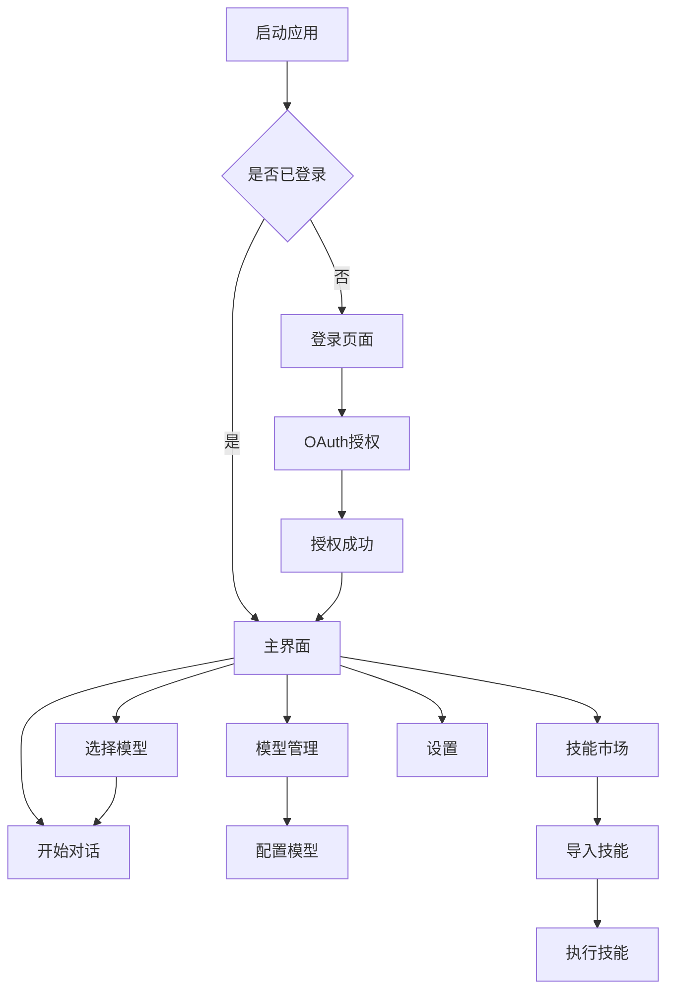

## 1. 产品概述

这是一个跨平台桌面AI助手客户端，支持Mac/Windows/Linux系统，提供智能对话、模型管理和高级AI功能集成。产品旨在为用户提供一个功能强大、界面友好的本地AI助手，支持多种AI模型和高级功能扩展。

目标用户：开发者、AI爱好者、需要本地AI助手的技术人员。产品价值：提供一站式AI模型管理和对话体验，支持MCP协议和技能扩展。

## 2. 核心功能

### 2.1 用户角色

| 角色 | 注册方式 | 核心权限 |
|------|----------|----------|
| 普通用户 | Google OAuth/GitHub OAuth | 基础对话、模型使用 |
| 高级用户 | 登录后自动升级 | 模型配置、MCP功能、技能导入 |

### 2.2 功能模块

客户端包含以下核心页面：

1. **登录页面**：Google登录、GitHub授权登录、错误提示
2. **对话主页面**：模型选择、对话界面、配置面板、侧边栏导航
3. **模型管理页面**：模型列表、模型配置、参数设置、MCP管理
4. **技能市场页面**：技能浏览、技能导入、技能执行、技能管理
5. **设置页面**：用户设置、应用配置、关于信息

### 2.3 页面详情

| 页面名称 | 模块名称 | 功能描述 |
|----------|----------|----------|
| 登录页面 | 第三方登录 | 支持Google OAuth和GitHub OAuth登录，提供清晰的登录按钮和错误提示 |
| 登录页面 | 错误处理 | 显示网络错误、认证失败、授权取消等状态 |
| 对话主页面 | 模型选择器 | 下拉选择可用模型，显示模型状态和能力 |
| 对话主页面 | 对话区域 | 支持多轮对话，显示用户输入和AI回复，支持代码高亮 |
| 对话主页面 | 输入框 | 支持多行输入，发送按钮，快捷键发送 |
| 对话主页面 | 侧边栏 | 历史对话记录，新建对话，设置入口 |
| 模型管理页面 | 模型列表 | 显示已配置模型，启用/禁用状态，模型信息展示 |
| 模型管理页面 | 模型配置 | API密钥配置，模型参数设置，最大token限制 |
| 模型管理页面 | MCP配置 | MCP服务器管理，协议版本，连接状态 |
| 技能市场页面 | 技能浏览 | 分类浏览技能，搜索功能，技能详情查看 |
| 技能市场页面 | 技能导入 | 本地技能包导入，在线技能安装，依赖检查 |
| 技能市场页面 | 技能执行 | 技能运行界面，参数输入，执行结果展示 |
| 设置页面 | 用户设置 | 个人信息管理，登录状态，注销功能 |
| 设置页面 | 应用配置 | 主题切换，语言设置，快捷键配置 |
| 设置页面 | 关于信息 | 版本信息，更新检查，开源协议 |

## 3. 核心流程

### 用户登录流程
用户打开应用 → 显示登录页面 → 选择登录方式 → OAuth授权 → 获取用户信息 → 进入主界面

### 对话流程
进入主界面 → 选择模型 → 输入问题 → 发送请求 → 显示回复 → 继续对话

### 模型配置流程
进入模型管理 → 添加模型 → 配置API密钥 → 测试连接 → 保存配置

### 技能使用流程
浏览技能市场 → 选择技能 → 导入技能 → 配置参数 → 执行技能 → 查看结果

## 4. 用户界面设计

### 4.1 设计风格

- **主色调**：深蓝色 (#1890ff) 为主色，白色背景，灰色辅助
- **按钮样式**：圆角矩形，Ant Design风格，悬停效果明显
- **字体**：系统默认字体，主要字号14-16px，标题18-24px
- **布局**：左侧导航+右侧内容区，卡片式布局，响应式间距
- **图标**：使用Ant Design图标库，线性图标风格，统一尺寸

### 4.2 页面设计概述

| 页面名称 | 模块名称 | UI元素 |
|----------|----------|----------|
| 登录页面 | 登录容器 | 居中卡片布局，圆角边框，阴影效果，品牌Logo居中显示 |
| 登录页面 | 登录按钮 | 大尺寸按钮，Google/GitHub品牌色，图标+文字组合 |
| 主界面 | 顶部栏 | 应用标题，模型选择器，用户头像，最小化/关闭按钮 |
| 主界面 | 侧边栏 | 可折叠设计，图标+文字导航，当前选中高亮 |
| 主界面 | 对话区 | 气泡式对话设计，用户消息右对齐，AI消息左对齐 |
| 主界面 | 输入区 | 底部固定，多行文本框，发送按钮，支持拖拽文件 |
| 模型管理 | 模型卡片 | 网格布局，卡片包含模型图标、名称、状态、操作按钮 |
| 技能市场 | 技能卡片 | 横向列表，包含技能图标、名称、描述、评分、安装按钮 |

### 4.3 响应式设计

采用桌面优先设计，针对Electron桌面环境优化：
- 最小窗口尺寸：800x600px
- 默认窗口尺寸：1200x800px
- 支持窗口大小调整，内容自适应
- 考虑高DPI屏幕适配
- 支持暗色主题切换

### 4.4 错误状态设计

- **网络错误**：友好提示，重试按钮
- **认证失败**：清晰错误信息，重新登录入口
- **模型调用失败**：具体错误原因，建议解决方案
- **加载状态**：骨架屏，加载动画
- **空状态**：引导性图标和文字，操作指引
