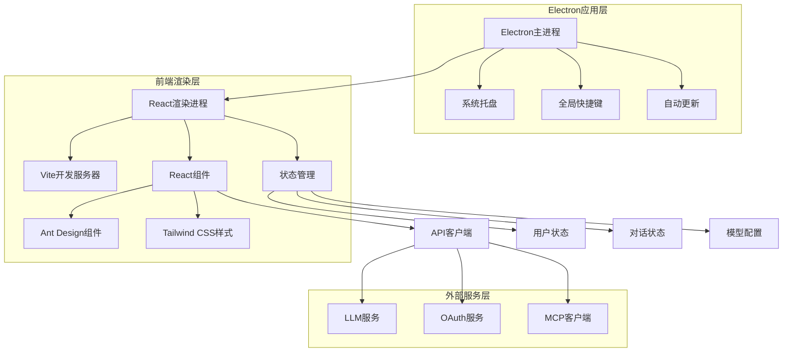
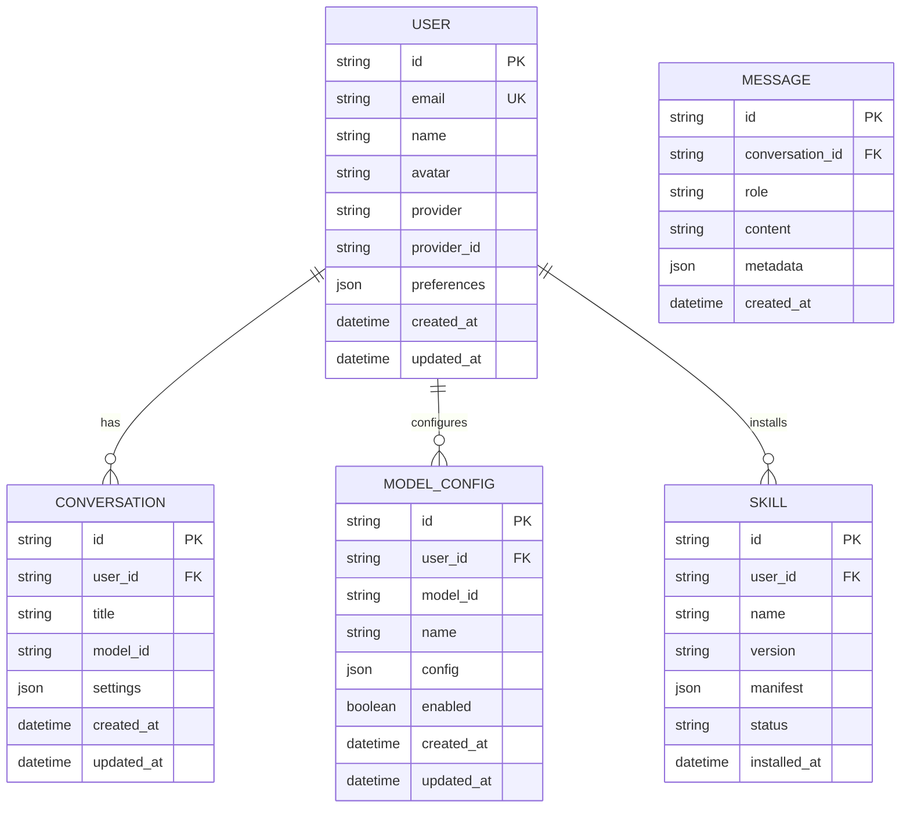

## 1. 架构设计



## 2. 技术描述

- **前端框架**: React@18 + TypeScript@5
- **构建工具**: Vite@7 + Rolldown（打包优化）
- **UI框架**: Ant Design@6 + Tailwind CSS@4
- **代码规范**: @antfu/eslint-config + Prettier
- **状态管理**: Zustand（轻量级状态管理）
- **路由**: React Router@6
- **HTTP客户端**: Axios + React Query
- **Electron**: electron@28 + electron-builder
- **测试框架**: Vitest + @testing-library/react
- **MCP协议**: @modelcontextprotocol/sdk
- **Claude SDK**: @anthropic-ai/sdk

## 3. 路由定义

| 路由 | 用途 |
|------|------|
| / | 登录页面，处理OAuth认证 |
| /chat | 主对话界面，核心功能页面 |
| /models | 模型管理，配置和切换AI模型 |
| /skills | 技能市场，浏览和管理技能 |
| /settings | 设置页面，用户和应用配置 |
| /error | 错误页面，显示各种错误状态 |

## 4. 目录结构设计

```
electron-ai-client/
├── electron/                    # Electron主进程代码
│   ├── main.ts                 # 主进程入口
│   ├── preload.ts              # 预加载脚本
│   ├── ipc/                    # IPC通信处理
│   ├── menu/                   # 应用菜单
│   ├── tray/                   # 系统托盘
│   └── updater/                # 自动更新
├── src/
│   ├── components/             # React组件
│   │   ├── common/             # 通用组件
│   │   ├── chat/               # 对话相关组件
│   │   ├── models/             # 模型管理组件
│   │   └── settings/           # 设置组件
│   ├── hooks/                  # 自定义Hooks
│   │   ├── useAuth.ts          # 认证相关
│   │   ├── useModels.ts        # 模型管理
│   │   ├── useChat.ts          # 对话处理
│   │   └── useMCP.ts           # MCP协议
│   ├── stores/                 # 状态管理
│   │   ├── authStore.ts        # 用户认证状态
│   │   ├── chatStore.ts        # 对话状态
│   │   ├── modelStore.ts       # 模型配置
│   │   └── settingsStore.ts    # 应用设置
│   ├── services/               # 服务层
│   │   ├── api/                # API客户端
│   │   ├── llm/                # LLM服务集成
│   │   ├── oauth/              # OAuth认证
│   │   └── mcp/                # MCP客户端
│   ├── types/                  # TypeScript类型定义
│   │   ├── auth.ts             # 认证相关类型
│   │   ├── chat.ts             # 对话相关类型
│   │   ├── models.ts           # 模型相关类型
│   │   └── mcp.ts              # MCP协议类型
│   ├── utils/                  # 工具函数
│   │   ├── constants.ts        # 常量定义
│   │   ├── helpers.ts          # 辅助函数
│   │   ├── storage.ts          # 本地存储
│   │   └── validators.ts       # 验证函数
│   ├── styles/                 # 样式文件
│   │   ├── globals.css         # 全局样式
│   │   └── variables.css       # CSS变量
│   ├── pages/                  # 页面组件
│   │   ├── Login.tsx           # 登录页面
│   │   ├── Chat.tsx            # 对话页面
│   │   ├── Models.tsx          # 模型管理
│   │   ├── Skills.tsx          # 技能市场
│   │   └── Settings.tsx        # 设置页面
│   ├── App.tsx                 # 根组件
│   ├── main.tsx                # 渲染进程入口
│   └── router.tsx              # 路由配置
├── public/                     # 静态资源
├── build/                      # 构建配置
│   ├── vite.config.ts          # Vite配置
│   ├── electron-builder.json   # Electron打包配置
│   └── rollup.config.ts        # Rolldown配置
├── tests/                      # 测试文件
├── .eslintrc.js                # ESLint配置
├── .prettierrc                 # Prettier配置
├── tsconfig.json               # TypeScript配置
└── package.json                # 项目依赖
```

## 5. 核心API定义

### 5.1 认证API

```typescript
// OAuth登录
POST /api/auth/oauth
{
  provider: 'google' | 'github',
  code: string,
  redirect_uri: string
}

// 响应
{
  access_token: string,
  refresh_token: string,
  user: UserInfo
}
```

### 5.2 对话API

```typescript
// 发送消息
POST /api/chat/completions
{
  model: string,
  messages: ChatMessage[],
  temperature?: number,
  max_tokens?: number,
  stream?: boolean
}

// 响应（流式）
interface ChatStreamResponse {
  id: string
  object: 'chat.completion.chunk'
  created: number
  model: string
  choices: {
    delta: { content?: string }
    index: number
    finish_reason?: string
  }[]
}
```

### 5.3 模型管理API

```typescript
// 获取模型列表
GET /api/models

// 响应
interface ModelInfo {
  id: string
  name: string
  provider: string
  capabilities: string[]
  enabled: boolean
  config: ModelConfig
}

// 更新模型配置
PUT /api/models/{id}/config
{
  api_key?: string
  base_url?: string
  parameters?: Record<string, any>
}
```

### 5.4 MCP协议API

```typescript
// 连接MCP服务器
POST /api/mcp/connect
{
  server_url: string
  capabilities?: string[]
}

// 执行MCP工具
POST /api/mcp/tools/execute
{
  tool_name: string
  arguments: Record<string, any>
}
```

## 6. 数据模型设计

### 6.1 用户模型



### 6.2 本地存储结构

```typescript
// IndexedDB 数据库结构
interface LocalDB {
  users: UserInfo[]
  conversations: Conversation[]
  messages: Message[]
  modelConfigs: ModelConfig[]
  skills: Skill[]
  settings: AppSettings
}

// Electron Store 配置
interface StoreSchema {
  user: UserInfo | null
  windowBounds: Rectangle
  theme: 'light' | 'dark'
  autoLaunch: boolean
  shortcuts: Record<string, string>
  apiKeys: Record<string, string>
}
```

## 7. 构建和打包配置

### 7.1 Vite配置要点

```typescript
// vite.config.ts
export default defineConfig({
  plugins: [
    react(),
    electron([
      {
        entry: 'electron/main.ts',
        onstart: id => console.log(`Electron main process started: ${id}`)
      },
      {
        entry: 'electron/preload.ts',
        onstart: id => console.log(`Electron preload script loaded: ${id}`)
      }
    ])
  ],
  build: {
    rollupOptions: {
      external: ['electron'],
      output: {
        format: 'cjs'
      }
    }
  },
  optimizeDeps: {
    exclude: ['electron']
  }
})
```

### 7.2 Electron Builder配置

```json
{
  "appId": "com.ai-client.app",
  "productName": "AI Desktop Client",
  "directories": {
    "output": "dist"
  },
  "files": [
    "build/**/*",
    "node_modules/**/*",
    "package.json"
  ],
  "mac": {
    "category": "public.app-category.productivity",
    "target": [
      {
        "target": "dmg",
        "arch": ["x64", "arm64"]
      }
    ]
  },
  "win": {
    "target": [
      {
        "target": "nsis",
        "arch": ["x64", "ia32"]
      }
    ]
  },
  "linux": {
    "target": [
      {
        "target": "AppImage",
        "arch": ["x64"]
      }
    ]
  }
}
```

## 8. 安全考虑

### 8.1 进程安全
- 启用contextIsolation
- 禁用nodeIntegration
- 使用preload脚本暴露必要API
- 实现IPC通信白名单

### 8.2 数据安全
- 敏感数据加密存储
- API密钥安全保存
- 本地数据库加密
- 网络请求HTTPS强制

### 8.3 更新安全
- 代码签名验证
- 自动更新HTTPS传输
- 更新包完整性校验
