# Super Client R - 架构设计图

本文档使用 Mermaid 语法描述系统架构，可在支持 Mermaid 的编辑器中渲染查看。

---

## 1. 整体系统架构

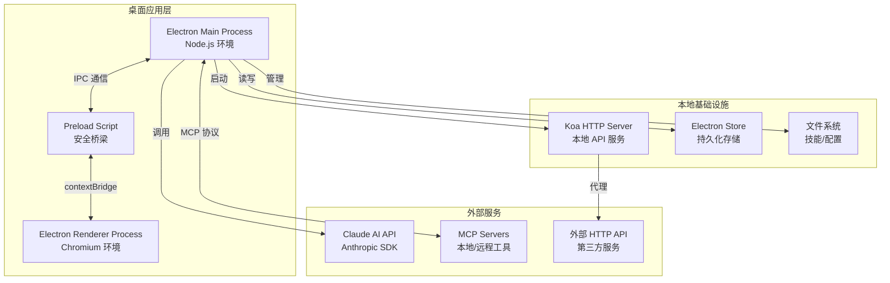

---

## 2. 进程间通信 (IPC) 架构

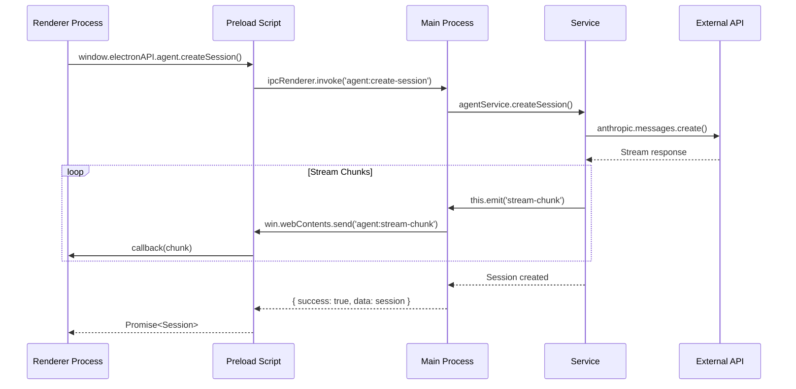

---

## 3. Main Process 服务架构

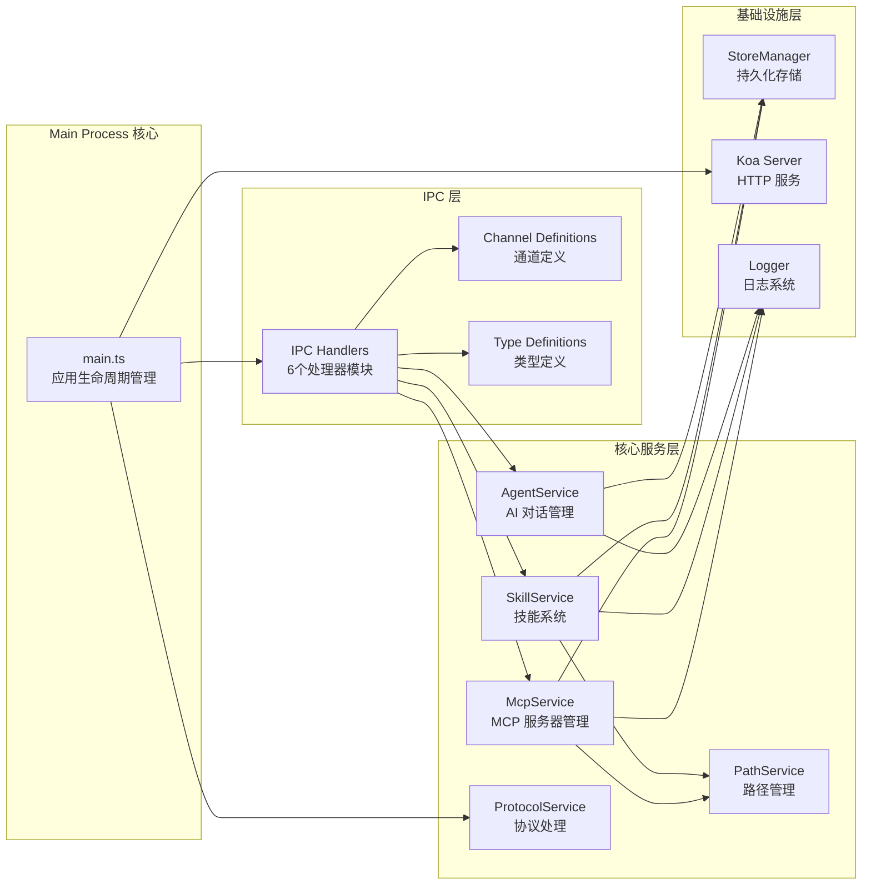

---

## 4. Renderer Process 架构

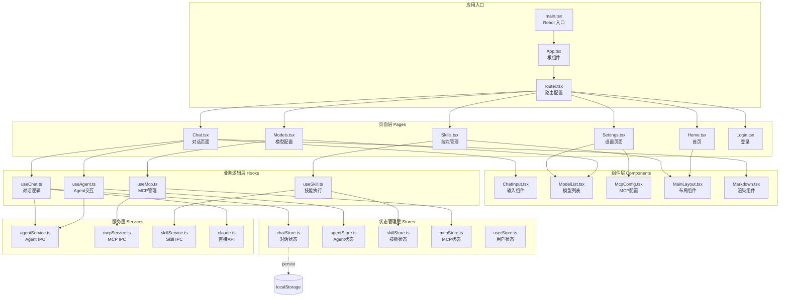

---

## 5. 数据流架构

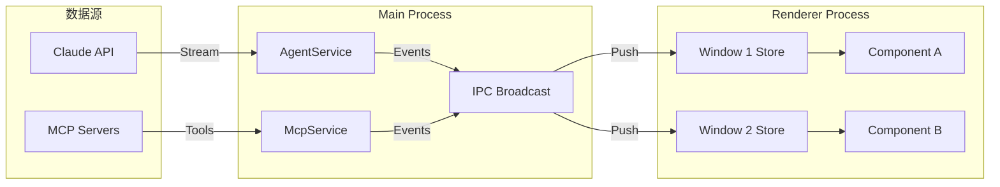

---

## 6. 技能系统架构

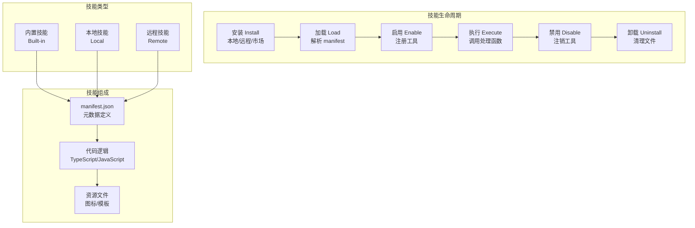

---

## 7. MCP (Model Context Protocol) 架构

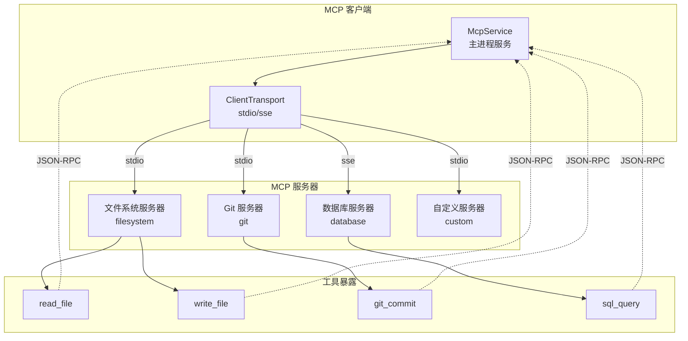

---

## 8. 本地 HTTP API 架构

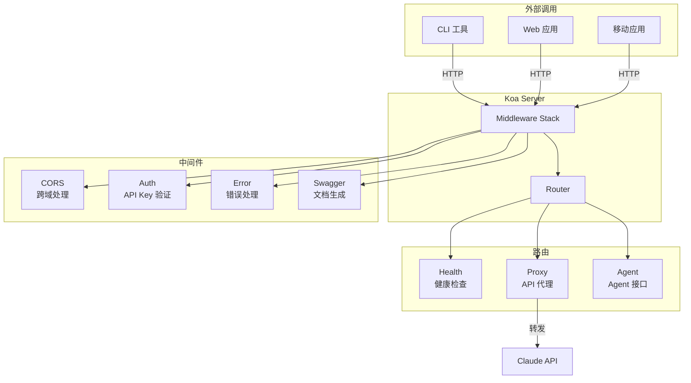

---

## 9. 窗口管理架构

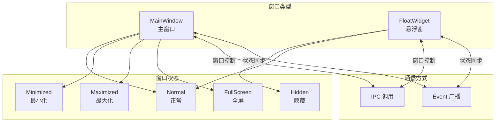

---

## 10. 安全架构

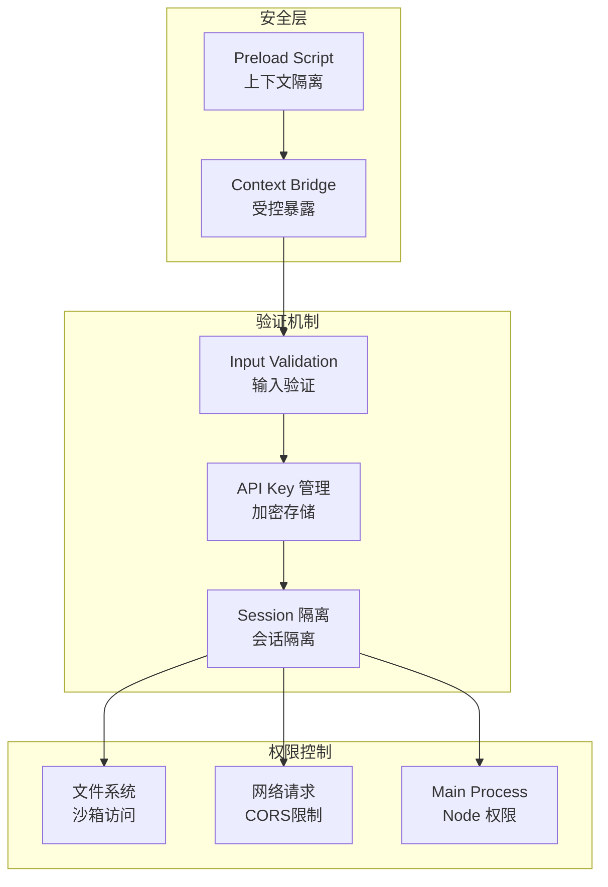

---

## 11. 模块依赖关系

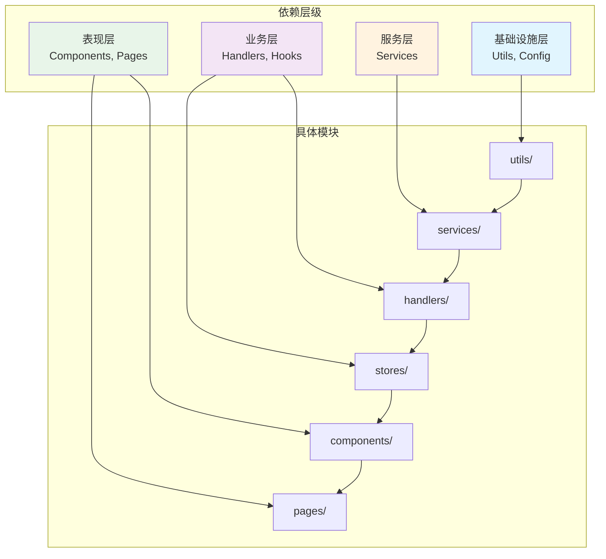

---

## 12. 部署架构

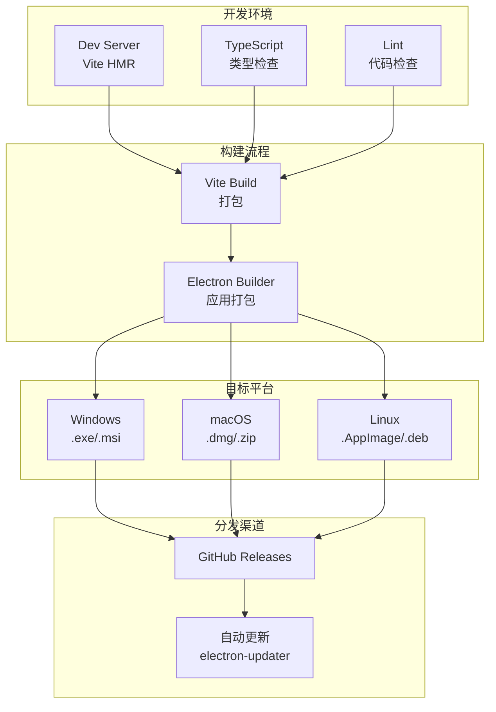

---

## 如何查看这些图表

1. **VS Code**: 安装 "Markdown Preview Mermaid Support" 插件
2. **GitHub**: 原生支持 Mermaid 渲染
3. **在线工具**: 使用 https://mermaid.live 粘贴代码查看
4. **Claude Artifacts**: 在 Claude 中直接渲染

---

## 架构设计原则

| 原则 | 说明 |
|------|------|
| **单一职责** | 每个模块只负责一个功能领域 |
| **依赖倒置** | 高层模块不依赖低层模块，都依赖抽象 |
| **IPC 隔离** | 主进程与渲染进程通过明确定义的通道通信 |
| **状态集中** | Main Process 作为状态的唯一真实来源 |
| **类型安全** | 全链路 TypeScript 类型覆盖 |
| **安全优先** | 最小权限原则，输入验证，上下文隔离 |
