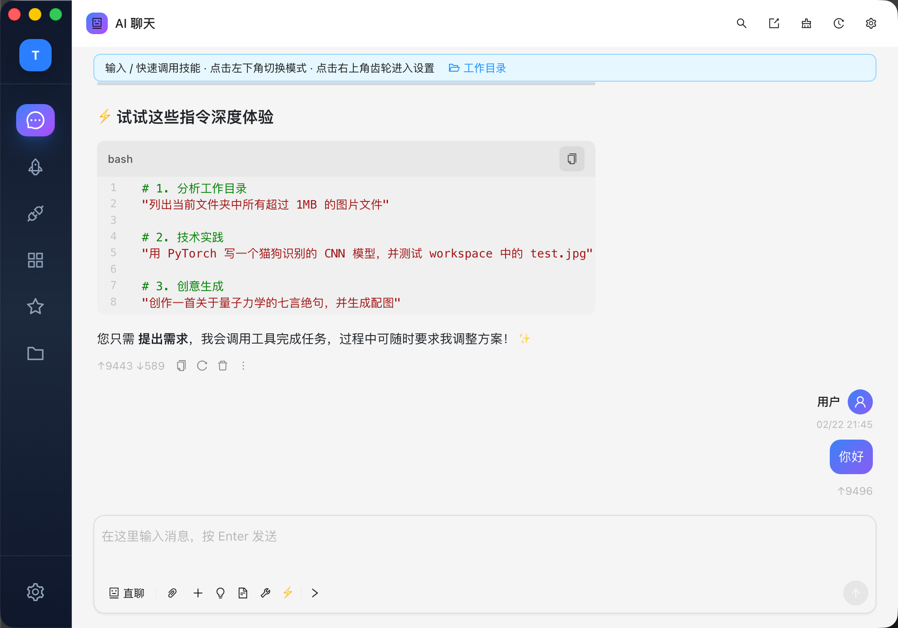
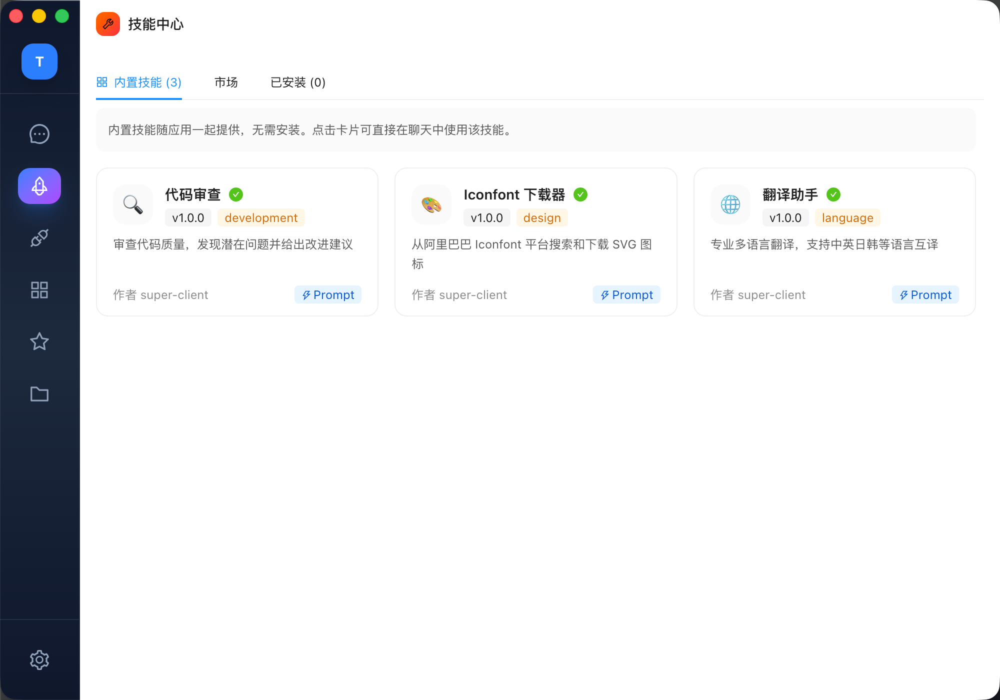
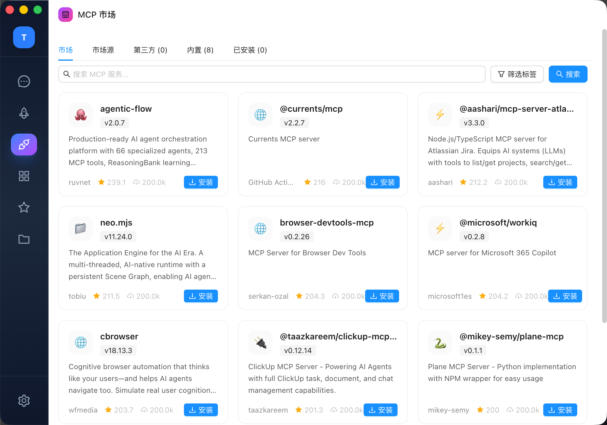
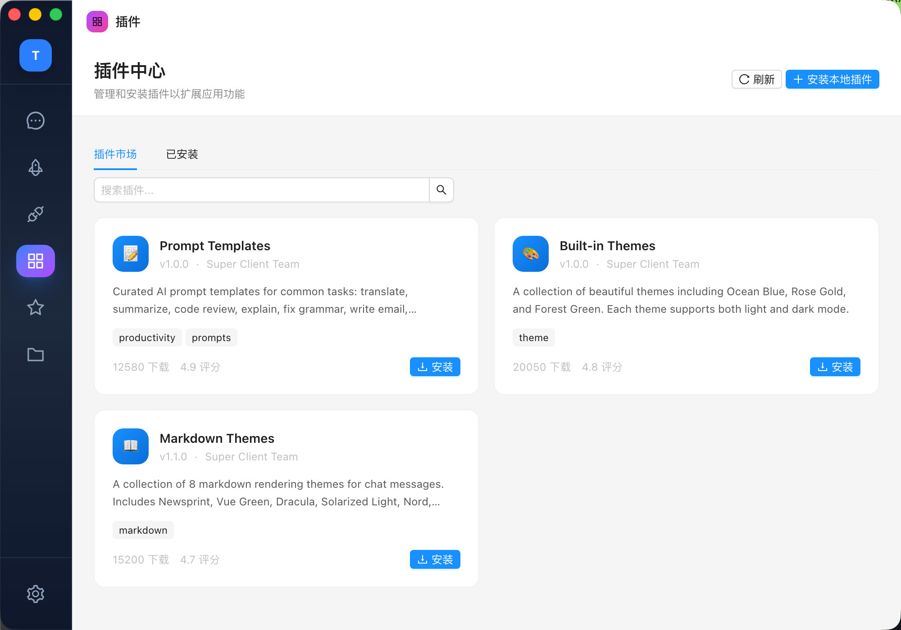
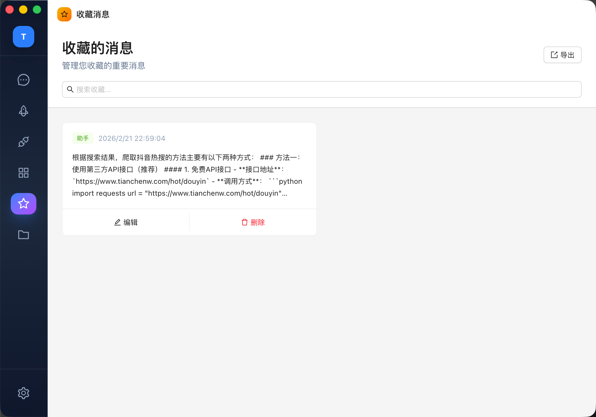
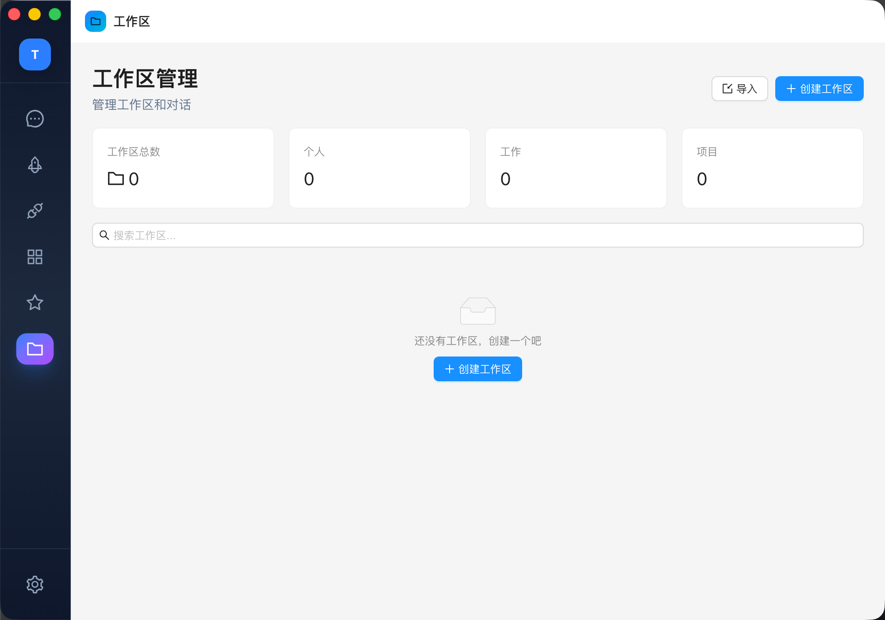
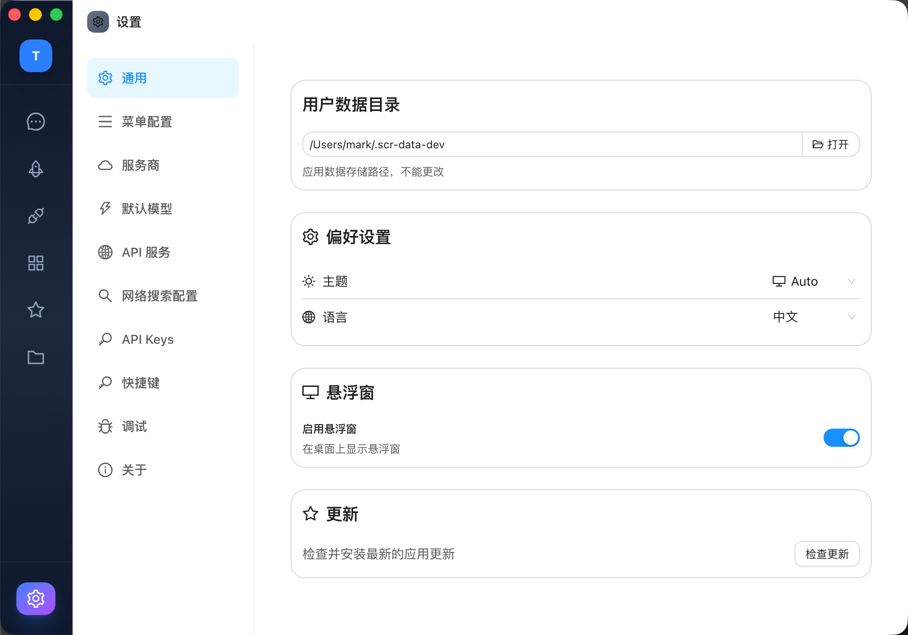
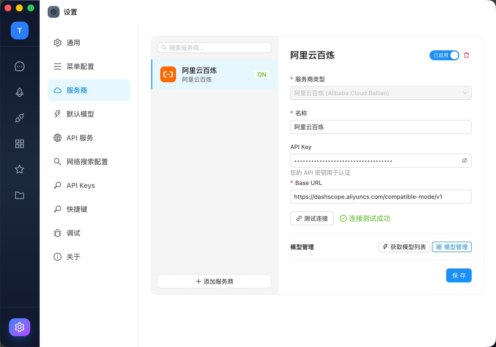

# Super Client R 功能介绍

Super Client R 是一个基于 Electron 的桌面 AI 客户端，集成了多模型对话、MCP 协议、技能扩展、插件系统等功能，打造一站式 AI 工作台。

---

## AI 对话

核心功能模块，支持与多种 AI 模型进行对话交互：

- **多模型切换** — 支持 Claude、GPT、Gemini、Deepseek 等主流模型，可在对话中随时切换
- **多种对话模式** — 支持直聊、附件、Prompt 模板、技能调用等多种输入方式
- **流式输出** — 实时流式渲染模型响应，支持 Markdown、代码高亮、Mermaid 图表
- **工具调用** — 对话中可调用 MCP 工具、技能等外部能力
- **工作目录** — 可绑定本地工作目录，为 AI 提供文件上下文

---

## 技能中心

内置可扩展的技能系统，提供开箱即用的实用工具：

- **代码审查** — AI 辅助代码审查，发现潜在问题并给出改进建议（development 标签）
- **Iconfont 下载器** — 从阿里巴巴 Iconfont 平台搜索和下载 SVG 图标（design 标签）
- **翻译助手** — 专业多语言翻译，支持中英日韩等语言互译（language 标签）
- **技能市场** — 支持从市场安装更多第三方技能
- **Prompt 快捷调用** — 点击技能卡片可直接在聊天中使用

---

## MCP 市场

集成 Model Context Protocol 服务器市场：

- **在线市场** — 浏览和搜索可用的 MCP 服务器，支持标签筛选
- **一键安装** — 快速安装和配置 MCP 服务器
- **多种来源** — 支持市场源、第三方和内置 MCP 服务器
- **已安装管理** — 统一管理已安装的 MCP 服务器
- **能力扩展** — 通过 MCP 协议为 AI 对话扩展文件读写、浏览器操作、项目管理等能力

---

## 插件中心

灵活的插件系统，支持个性化定制：

- **Prompt 模板** — 精选 AI 提示词模板，覆盖翻译、摘要、代码审查、语法修正等常见任务
- **内置主题** — 多款精美主题（Ocean Blue、Rose Gold、Forest Green 等），支持亮色/暗色模式
- **Markdown 主题** — 8 种消息渲染主题（Newsprint、Vue Green、Dracula、Solarized Light、Nord 等）
- **本地插件** — 支持安装本地开发的插件
- **插件市场** — 在线搜索和安装插件，查看下载量和评分

---

## 收藏夹

消息收藏功能，方便快速回顾重要内容：

- **消息收藏** — 收藏任意对话中的 AI 回复
- **搜索过滤** — 快速搜索收藏的消息
- **编辑与删除** — 支持编辑收藏备注或删除收藏
- **批量导出** — 一键导出所有收藏内容

---

## 工作区

多工作区管理，支持不同场景的上下文隔离：

- **分类管理** — 工作区支持个人、工作、项目三种分类
- **统计概览** — 首页展示工作区总数和分类统计
- **导入导出** — 支持导入已有工作区或创建新工作区
- **搜索过滤** — 快速搜索和定位目标工作区

---

## 通用设置

全局应用配置，设置侧栏包含通用、菜单配置、服务商、默认模型、API 服务、网络搜索配置、API Keys、快捷键、调试、关于等分类：

- **用户数据目录** — 应用数据独立存储路径
- **偏好设置** — 主题（亮色/暗色/Auto）、语言（中文/English）
- **悬浮窗** — 桌面悬浮小组件，快速唤起对话
- **自动更新** — 检查并安装最新版本
- **快捷键** — 全局快捷键配置
- **调试工具** — 内置调试面板

---

## 服务商配置

AI 服务商管理，灵活配置多种模型源：

- **多服务商** — 支持 Anthropic、OpenAI、Google、Azure、阿里云百炼、Bedrock、xAI 等主流服务商
- **自定义端点** — 可配置 Base URL，兼容自部署/代理/国内云服务
- **API Key 管理** — 安全管理各服务商的 API 密钥，支持密码遮罩显示
- **连接测试** — 一键验证服务商配置是否可用，实时显示测试结果
- **模型管理** — 获取模型列表、启用/禁用模型、模型管理面板
- **多服务商并存** — 支持同时配置多个服务商，按需启用/禁用
