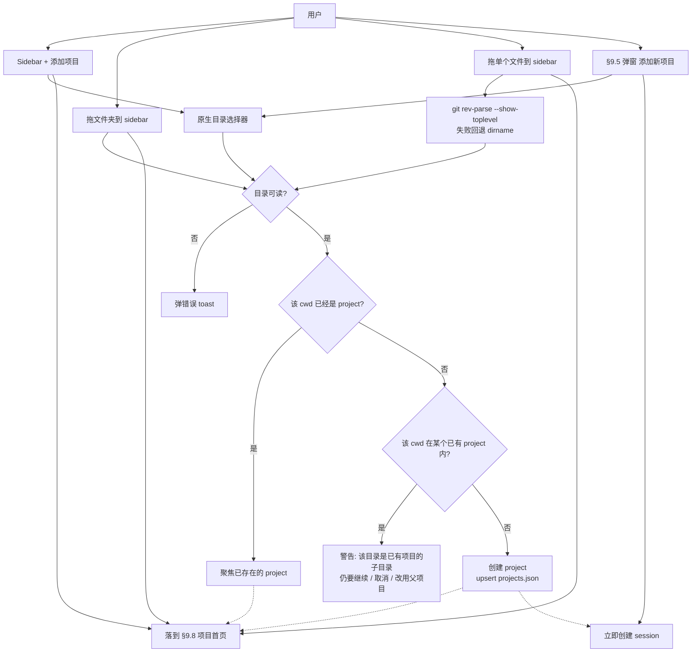
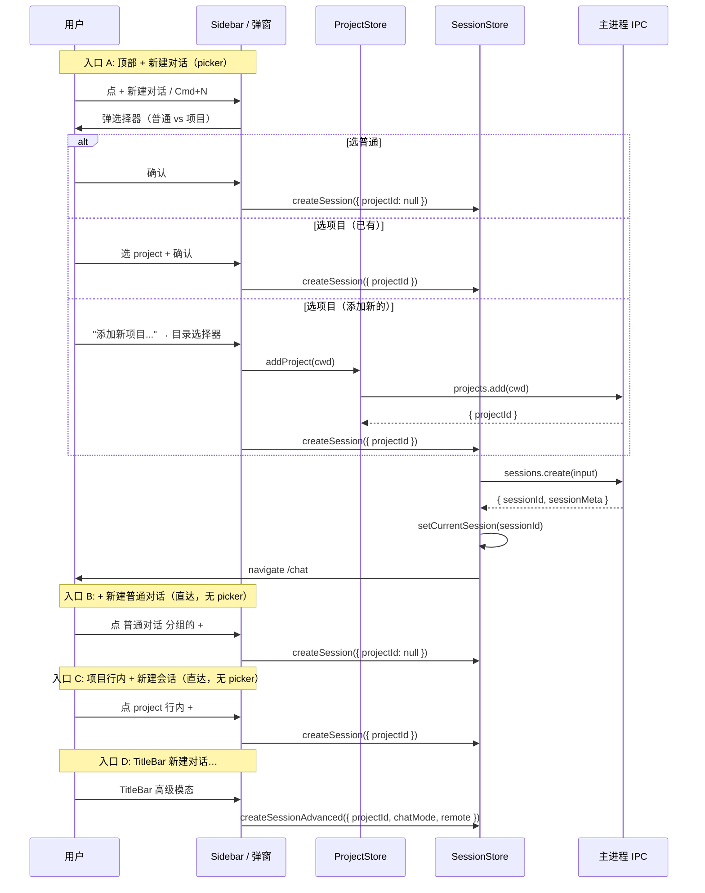

# 项目 / 会话重设计 plan

> 重构总入口：[refactor-plan](./refactor-plan.md) ·
> 历史 ui-plan：[ui-plan](./workspace-session-ui-plan.md) ·
> 创建/删除链路：[creation-flow](./workspace-session-creation-flow.md)
>
> **本文 supersedes**：`workspace-session-ui-plan.md` 中所有"Workspace 作为独立配置实体"的章节（§2 product model 中的 Workspace 层、§4 workspace source-of-truth、§15 workspace settings、§16 `WorkspaceConfig`、§26.4 R-1）。R-1 phase 1 + phase 2 在本计划下变成**过渡兼容层**，最终被删除。
>
> 状态说明：本文中的 `✅` 是历史实施记录或当时的切片状态。进入新一轮实现、合并或声称完成前，必须按 [refactor-execution-gates](./refactor-execution-gates.md) 重新验证当前代码、测试和手测证据。

## 1. 出发点（用户给出的需求）

1. **取消 Workspace 抽象**。"工作环境"应当就是"一个特定目录" —— 跟 Codex 一致。
2. **会话归属于工作环境**。一个目录下面挂 N 个 session 对话。
3. **会话存储要重做**。当前每个 session 是一份 `messages.json`，消息越来越多 → 文件越来越大 → 整文件读写有瓶颈。
4. **当前 JSON 可考虑作为配置文件**（小、读多写少、可整体加载），不再用作消息日志（大、追加为主、只读尾部）。
5. **参考业界优秀案例**。

## 2. 参考架构（基于本机真实证据）

> 注：在线搜索不可用；以下是直接观察 `/Users/mark/.claude` 与 `/Users/mark/.codex` 的目录结构得出。

### 2.1 Claude Code（`~/.claude/`）

```
projects/
  -Users-mark-myself-code-super-client-r/    ← cwd 路径，slash → dash 编码
    b3f6c748-1196-4c2f-aaed-fe997455147a.jsonl   (150 lines)
    b82aed87-1984-49b3-9e47-5a47cdfaa264.jsonl   (5072 lines) ← 实测无瓶颈
    c05a090a-918d-474a-b4a2-95d2d9bdfc69.jsonl   (107 lines)
    memory/
sessions/                  ← 临时 session env, 跟消息无关
session-env/
plugins/  skills/  hooks/  ← 配置类
```

要点：
- **项目 = cwd 目录**。无独立"workspace"配置实体。
- **路径作为 ID**（slash 替换为 dash 做文件名），可逆。
- **每会话一个 `<id>.jsonl`**：JSON Lines，append-only。每行一个事件（消息、tool_use、tool_result、file-history-snapshot、attachment …）。
- **5000+ 行可正常读**。tail -f 友好，stream parse 友好。
- 配置类（plugins/skills/hooks）跟会话数据严格分目录。

### 2.2 Codex（`~/.codex/`）

```
config.toml                          ← 全局配置（TOML，非 JSON）
auth.json                            ← 凭证（小 JSON）
sessions/2026/06/11/
  rollout-2026-06-11T21-07-05-<uuid>.jsonl  (12 lines)
sessions/2026/03/...                 ← 按年/月/日分桶
```

要点：
- 同样 JSONL append-only。
- **按时间分桶**而不是按项目分桶。这反映 Codex 的"无项目模型" —— 会话用 `cwd` 字段携带工作目录，而不是文件系统目录组织。
- 时间分桶减少单目录文件数，但跨项目的会话列表需要扫描树。

### 2.3 两种风格的取舍

| 维度 | Claude Code 风格<br>（按项目分桶） | Codex 风格<br>（按时间分桶） |
|---|---|---|
| 列出"这个项目下的所有会话" | 单目录 `readdir` —— 最快 | 全树扫描 + filter cwd —— 慢 |
| 列出"最近 N 天的会话" | 跨项目 `readdir + stat` | 直接走最近的日期目录 —— 最快 |
| 路径变化（用户重命名/移动项目） | 旧编码失效、需要迁移 | 无影响（项目只是 jsonl 内的字段） |
| 路径暴露 | 目录名暴露用户路径 | 不暴露 |

我们的产品形态更接近 Claude Code（用户主要操作是"在某个项目下继续工作"，而不是"看最近 N 天我都聊了什么"），所以 **采用 Claude Code 风格**：按项目分桶，cwd 作为项目 id。

## 3. 新的概念模型

```
App
├── Casual Sessions                  ← projectId = null 的会话（普通对话）
│   ├── <session-id>.jsonl
│   └── <session-id>.meta.json
│
└── Project                          ← cwd 路径就是 ID
    ├── name (display)               ← 默认 = basename(cwd)，用户可改
    ├── icon (display, optional)
    ├── settings.json (sparse)       ← 模型默认值 / approvalMode / sandbox / …
    └── Sessions                      ← projectId = <this Project> 的会话（项目对话）
        ├── <session-id>.jsonl       ← 消息 + 工具调用事件流，append-only
        └── <session-id>.meta.json   ← 小元数据：name, createdAt, lastUpdatedAt, chatMode, remote, flags, lineage
```

**核心原则**：
- "Project" = "cwd 路径 + 一点儿展示元数据"，不再是独立的配置容器。
- **Session 分两类**（详见 §9）：
  - **普通对话** (`projectId = null`)：不绑定任何 project，工具/Agent 没有 cwd 上下文（落到家目录）
  - **项目对话** (`projectId = <id>`)：绑定到某个 project；工具/Agent/file-actions 在该 cwd 下运行
- 配置（model / runtime policy / context policy）从 `WorkspaceConfig` 拆出来，放在 **三层**：
  - **App 全局** `~/.../config.json`：默认值。
  - **Project**（可选）`<project>/settings.json`：覆盖该 cwd 下所有会话。
  - **Session**（可选）`<session>.meta.json`：单会话覆盖。
- 不存在"默认 project"。普通对话本身就是兜底——sidebar `+ 新建对话` 在没选项目时直接创建普通对话。
- 会话的两条产品轴：`chatMode`（chat / agent / plan / remote / automation，**B7 折叠**）+ `remote`（绑定的 IM bot）；都不是 project 的属性。

**取消的字段**（来自旧 `Workspace`/`WorkspaceConfig`）：
- `description / type / color`：纯 UI 装饰，刻意不要。如果要分组，由 project 名称、icon、tag 完成。
- `enabled`：项目永远"启用"。删除等于把项目从 registry 移除。
- `sessionIds / activeSessionId`：从文件系统派生，不再独立维护。
- `interactionProfile`：作为 app 全局/project settings 的字段而非 project 身份。

## 4. 存储重设计

### 4.1 选型决策：JSONL + 小 manifest（不引入 SQLite）

| 候选 | 优 | 劣 | 决策 |
|---|---|---|---|
| **JSONL append-only**（推荐） | 写入 O(1) 追加，没有整文件 rewrite；崩溃半行可丢弃；流式 parse；纯文本可被外部工具看 | 不能高效"按 messageId 改单条" —— 但聊天本身就是 append 模型，改一条历史本就罕见 | ✅ |
| 单大 `messages.json` | 简单 | 整文件 rewrite，已经是当前的瓶颈 | ❌ |
| SQLite + better-sqlite3 | 索引查询快；FTS5 全文搜索 | native 模块（需要 prebuilt 跨平台）；schema migration；blast radius 大；备份时单文件锁 | 后续真正需要"跨会话搜索/全文索引"再上 |
| IndexedDB（renderer） | 浏览器原生 | 需要把数据从 main 搬到 renderer；备份/同步策略复杂；多窗口需 broadcast | ❌ |

**结论**：第一阶段全部用 JSONL + 旁挂小 meta JSON。"跨会话搜索"留到真正需要时再加 SQLite 索引（索引可以 derive 自 JSONL，不破坏数据所有权）。

### 4.2 目录布局

```
<userData>/super-client/
├── config.json                          ← App 全局配置（小，整体读写）
├── projects.json                        ← Project registry：path → { id, name, icon, lastSeenAt }
│
├── casual-sessions/                     ← 普通对话（projectId === null）
│   ├── <sessionId>.jsonl                ← 消息事件流
│   ├── <sessionId>.meta.json            ← 会话元数据（projectId: null）
│   └── <sessionId>/                     ← per-session 附属：附件 / tool-outputs
│       ├── attachments/
│       │   └── <attachmentId>
│       └── tool-outputs/
│
└── projects/
    └── <projectId>/                     ← projectId = stable hash(cwd)
        ├── settings.json                ← Project 级覆盖（可选，存在即用）
        ├── path.txt                     ← 原始 cwd 字面量，恢复 / 验证用（§11.11）
        └── sessions/
            ├── <sessionId>.jsonl        ← 消息事件流
            ├── <sessionId>.meta.json    ← 会话元数据（projectId: <id>）
            └── <sessionId>/             ← per-session 附属
                ├── attachments/         ← (S1) 跟当前代码一致：每个 session 自己的附件目录
                │   └── <attachmentId>
                └── tool-outputs/
```

设计要点：
- **Per-session 的附件 / tool-outputs**（S1）—— 不做项目级共享。删 session 时连带删干净，不会留孤儿引用；同一文件被多个 session 引用就允许各存一份（hardlink 优化是后期事）。
- **`path.txt` 与 hash 双写**（P3）：projectId 是 `hash(cwd)`，但实际 cwd 字面量也写到 `<projectId>/path.txt`。两个用途：a) `projects.json` 损坏时可以从文件系统重建；b) 给"恢复孤儿目录"的入口（§11.11）提供数据。
- **为什么 projectId 用 hash 而不是 dash-encoded 路径**：
  - 用户 rename / 移动项目时，路径变了但 projectId 不变（只更新 `projects.json` 的 `path` 字段）
  - 不在文件系统暴露用户私密路径
  - 备份/同步时 hash 是 portable 的

### 4.3 JSONL 事件协议

每行一个 JSON 对象，必含 `type` 字段：

```jsonc
// User message
{"type":"user_message","id":"msg_xxx","ts":1750000000000,"content":"...", "attachmentIds":[...]}

// Assistant message (final form)
{"type":"assistant_message","id":"msg_yyy","ts":...,"content":"...","metadata":{"model":"...","tokens":...}}

// Streaming chunk (optional, can be omitted from disk; only final assistant_message is canonical)
// — choice: NOT persist chunks, only persist final assistant_message after stream ends.

// Tool call request
{"type":"tool_call","id":"tc_xxx","parentId":"msg_yyy","ts":...,"name":"...","input":{...}}

// Tool call result
{"type":"tool_result","toolCallId":"tc_xxx","ts":...,"output":"...","isError":false,"duration":1234}

// Approval decision (audit)
{"type":"approval","ts":...,"toolCallId":"tc_xxx","decision":"allow_once|allow_session|deny","reason":"..."}

// File artifact reference
{"type":"file_artifact","ts":...,"messageId":"...","path":"...","kind":"created|modified|read"}

// Session-level marker (mode lock, plan-mode change, …)
{"type":"session_marker","ts":...,"key":"chatMode","value":"agent"}
```

不持久化流式 chunk —— 流是 ephemeral，最终只把"完成的 assistant message"作为一行落盘。这跟 Claude Code 的做法一致。

### 4.4 读取策略（这是用户关心的"大文件不会瓶颈吗"）

| 用途 | 实现 |
|---|---|
| 列项目下的 session 元数据列表 | `readdir(sessions/) + read every .meta.json`（小文件，毫秒级） |
| 打开某个会话渲染消息 | `readFileSync(<id>.jsonl)` 一次读完，内存里 reduce 成 `Message[]`。5k 行也只是几 MB；且只在切到该会话时读 |
| 长会话超大优化（未来） | 同时维护 `<id>.summary.json`（最后 N 条 + tool 摘要）→ UI 只渲染最近窗口 + "load older" 按钮 |
| 跨项目搜索（未来） | 启动时 lazy build SQLite 索引；JSONL 仍是 source of truth |
| 写消息 | `appendFileSync('\n' + JSON.stringify(line) + '\n')` —— O(1) |
| 改单条消息（罕见：用户编辑历史） | 重写整个 jsonl 一次。罕见 + 用户预期慢 |

**容量参考**：单条用户消息 ~200B，assistant ~2KB，tool_result 可能 50KB。粗算 1000 轮对话约 50MB JSONL —— 一次性 read 仍 < 100ms。

### 4.5 失败模式与恢复

- 写入崩溃 → 最后一行可能不完整 → parse 时遇到非法 JSON 跳过该行并截断到上一个 `\n`。append-only 的核心好处。
- 备份 → 用户复制整个 `<projectId>/` 目录即可；不需要"导出工具"。
- 损坏检测 → meta.json 记 `lineCount`；启动时与实际行数 cross-check。

## 5. API / 类型重设计

```ts
// shared-types/project.ts (new)

export interface Project {
  id: string;                    // stable hash(cwd)
  cwd: string;                   // absolute path
  name: string;                  // display, defaults to basename(cwd)
  icon?: string;
  createdAt: number;
  lastSeenAt: number;            // 更新于：session 创建/打开
  pinned?: boolean;              // 顶部置顶
}

export interface ProjectSettings {
  // sparse — 只存覆盖字段
  defaultModel?: ModelSelection;
  runtimePolicy?: Partial<WorkspaceRuntimePolicy>;
  contextPolicy?: Partial<WorkspaceContextPolicy>;
  interactionProfile?: InteractionProfile;
  enabledCapabilities?: EnabledCapability[];
}

/**
 * (B7 Option A) `kind` 字段彻底取消；产品分类全部下沉到 `chatMode` 这一个轴。
 * 旧 SessionKind 的 5 个值 (chat | agent | plan | remote | automation) 直接成为
 * 新 chatMode 的取值集合，不再有"kind=agent + chatMode=agent"这种语义重复。
 */
export type ChatMode =
  | 'chat'        // 普通 LLM 直接对话（替代旧 'direct' + 旧 kind=chat）
  | 'agent'       // Agent SDK 带工具
  | 'plan'        // 规划会话（暂未启用，预留）
  | 'remote'      // 绑定 IM bot 的会话
  | 'automation'; // 自动化任务（暂未启用，预留）

export interface SessionMeta {
  id: string;
  /** (B6) null = 普通对话；非 null = 项目对话 */
  projectId: string | null;
  name?: string;
  /** (B7) 取代旧 kind + 旧 chatMode；首条消息发送后锁死（§9.10） */
  chatMode: ChatMode;
  remote?: RemoteBinding;
  createdAt: number;
  updatedAt: number;
  messageCount: number;          // 来自 jsonl 行数（消息类型计数）
  preview?: string;              // 第一条用户消息前 100 字
  flags?: SessionFlags;          // pinned/archived/unread —— 已在 R-9 落地
  lineage?: SessionLineage;      // forkOriginId/worktreePath/forkOriginMessageId
  modelOverride?: ModelSelection;
  // …
}

/**
 * (S8) §10 #5 编辑历史 = fork：在某条消息位置分支出新会话。
 * `forkOriginMessageId` 标记从源会话的哪条消息开始派生。
 * 旧 R-9 的 SessionLineage 只有 forkOriginId / worktreePath，本次扩展。
 */
export interface SessionLineage {
  forkOriginId?: string;
  worktreePath?: string;
  forkOriginMessageId?: string;  // (S8) 新增
}
```

IPC 重新组织：

```ts
projects: {
  list(): Promise<Project[]>;                              // 来自 projects.json
  add(cwd: string, name?: string): Promise<Project>;
  rename(id: string, name: string): Promise<Project>;
  remove(id: string, opts?: { keepFiles?: boolean }):
    Promise<{ removed: boolean; orphan?: boolean }>;       // keepFiles=true → 仅 unregister；变成 §11.11 孤儿
  pin(id: string, pinned: boolean): Promise<Project>;
  
  getSettings(id: string): Promise<ProjectSettings>;       // 默认空对象
  saveSettings(id: string, patch: Partial<ProjectSettings>): Promise<ProjectSettings>;
  
  // §11.11 孤儿恢复：扫描 projects/<id>/path.txt 找到所有未 register 的目录
  listOrphans(): Promise<Array<{ projectId: string; cwd: string; sessionCount: number }>>;
  restoreOrphan(projectId: string): Promise<Project>;
};

sessions: {
  // (B3) projectId === null 走 casual-sessions/；非 null 走 projects/<id>/sessions/
  list(projectId: string | null): Promise<SessionMeta[]>;
  // (C1) 创建时 projectId / chatMode 进入 meta；首条消息发送前可改（§9.10）
  create(input: {
    projectId: string | null;
    name?: string;
    chatMode?: ChatMode;          // (B7) 默认 'chat'
  }): Promise<SessionMeta>;
  // (C1) 仅在 messageCount === 0 时允许；之后报错。等价于"撤销创建+重建"（保留 sessionId）
  reassignProject(sessionId: string, nextProjectId: string | null): Promise<SessionMeta>;
  
  rename(sessionId: string, name: string): Promise<void>;
  delete(sessionId: string): Promise<void>;
  getMeta(sessionId: string): Promise<SessionMeta>;
  updateMeta(sessionId: string, patch: Partial<SessionMeta>): Promise<SessionMeta>;
  
  // 读取消息流（一次性 / 可选 range / 可选只读尾部）
  readMessages(sessionId: string, range?: { fromLine?: number; tail?: number }): Promise<Message[]>;
  
  // 追加事件（消息 / 工具调用 / 等）
  appendEvent(sessionId: string, event: SessionEvent): Promise<void>;
  
  // 编辑历史 = fork（§9.10、§10 #5），不直接 rewrite
  // rewriteMessages 仅留给 migration / repair 内部，不暴露
  
  // Fork / worktree
  fork(sourceSessionId: string, opts: {
    kind: 'local' | 'worktree';
    /** §9.10 "派生为项目对话"：casual → project，必传 targetProjectId */
    targetProjectId?: string | null;
  }): Promise<SessionMeta>;
};

cwd: {
  // null projectId（普通对话）→ 用户家目录；项目对话 → project.cwd
  resolveSessionCwd(sessionId: string): Promise<string>;
};

// (S7) §9.5 picker 的 sticky 默认值，跨重启保留
appConfig: {
  // ... 已有 ...
  getNewConversationDefaults(): Promise<{
    lastKind: 'casual' | 'project';
    lastProjectId?: string;     // 当 lastKind === 'project' 时有意义
  }>;
  setNewConversationDefaults(value: {
    lastKind: 'casual' | 'project';
    lastProjectId?: string;
  }): Promise<void>;
};
```

**与现有代码的映射**：
- `useChatStore.conversations` → `useSessionListStore.sessionsByProject[currentProjectId]`
- `useChatStore.currentConversationId` → `useSessionStore.currentSessionId`
- `WorkspaceConfig` → 拆成 `Project` (registry 项) + `ProjectSettings` (sparse override)
- `useWorkspaceStore` / `useWorkspaceConfigStore` → 全部删除，统一 `useProjectStore`

## 6. UI 重设计

### 6.1 Sidebar 信息架构

**完整布局见 §9.3**（包含三段：Recent / 普通对话 / Projects + 顶部 `+ 新建对话`）。本节仅列出与之前 Workspace UI 的对比要点：

- **取消"workspace switcher"**：项目列表直接展开在 sidebar，没有"切换工作区"动作；切换 project 等同于点击 sidebar 里的项目行。
- **取消 `description / type / color` 字段编辑**：项目只有 name + icon。
- **删除项目** 询问"是否同时删除会话历史"。registry 删 vs 物理删除分开。
- **普通对话** 单独一组，与 Projects 分开，对应 `casual-sessions/`。

### 6.2 Project settings 页

不是独立 sidebar 项目，而是"右键 project → 设置"。设置面板字段就是 `ProjectSettings` 那几个 sparse 字段，全部"留空 = 走 app 默认"，每个字段旁有 reset 按钮。

### 6.3 删掉的 UI

- `/workspaces` 路由（替换成 `/projects` 或者纯粹用 sidebar）
- `WorkspaceSwitcher` / `WorkspaceCard` —— 不再需要
- "默认工作区"标记
- 颜色 / type / description 编辑器
- `WorkspaceRuntimeForm` 中的"项目路径" 字段 —— 这是冗余字段，因为 project 本身就 IS 路径

### 6.4 §25 创建链路在新模型下

**完整入口表见 §9.4**（4 条规范入口：顶部 `+ 新建对话` / 普通对话分组 `+` / 项目行内 `+` / TitleBar `新建对话…`）。本节不再列举 —— 之前那张表沿用了上一版的"伪默认项目 fallback"语义，已被 §9 重设计取代。

跟 §25（旧 plan）的差别要点：
- 旧 §25 说"默认 workspace fallback" → 新模型下没有"默认项目"，普通对话直接兜底
- 旧 §25 三入口（普通快建 / 项目快建 / 高级模态）→ 新 §9.4 拆成四入口（顶部带 picker 的 `+ 新建对话` 单独算一条；TitleBar 高级模态保留）

## 7. 迁移策略

### 7.1 旧数据形状（当前）

```
<userData>/chats/<conversationId>/
  metadata.json          ← ConversationSummary
  messages.json          ← ChatMessagePersist[] —— 整文件
  workspace/             ← per-conversation execution dir
  attachments/
```

加上：
- `~/Library/.../electron-store/config.json` 里的 `workspaceConfigs[]`
- renderer localStorage 的 `workspace-storage`（rich UI 字段）

### 7.2 一次性迁移脚本（main 进程启动时跑一次，幂等）

每条旧 conversation 走以下决策树：

```
For each <conversationId> in chats/:
  meta = read metadata.json
  oldWorkspaceId = meta.workspaceId
  oldWorkspaceConfig = workspaceConfigs[oldWorkspaceId]
  
  # (B5) 决定迁成普通对话 vs 项目对话
  if oldWorkspaceId === 'default' AND !oldWorkspaceConfig?.path:
    # 旧 default workspace + 没有用户配置的 cwd → 普通对话
    target = casual-sessions/<conversationId>.{jsonl,meta.json}
    targetProjectId = null
  else:
    # 其它情况：建项目对话
    cwd = oldWorkspaceConfig?.path                                          # 用户显式设过项目路径（R-4）
       || `<userData>/super-client/imported-projects/<oldWorkspaceId>`     # (P6) 占位伪 cwd 在 userData 内，避免污染用户 home；标 needsCwdReview
    targetProjectId = ensureProject(cwd, name = oldWorkspaceConfig?.name)
    target = projects/<targetProjectId>/sessions/<conversationId>.{jsonl,meta.json}
  
  # JSONL conversion (S1 per-session attachments)
  msgs = read messages.json
  jsonl = msgs.map(toEvent).join('\n')
  write target.jsonl
  write target.meta.json (from meta + jsonl line count, projectId: targetProjectId)
  
  # 附件 per-session
  move chats/<conversationId>/attachments → <session-dir>/<conversationId>/attachments
  move chats/<conversationId>/tool-outputs → <session-dir>/<conversationId>/tool-outputs

Mark migration done in config.json

# 旧 chats/ 目录**保持原样不动**（Phase E 才清理）
```

要点：
- **不 rename / 不 delete 旧 chats/**（修订自原版）：Phase B 完成时 Phase C 还没切 renderer，老 `chat.*` IPC 仍要读 `chats/`。如果 rename，老路径直接断。所以迁移是纯 **copy** 而非 move；Phase E 统一清理旧目录前用户可以两条数据并存。
- **`needsCwdReview` 标志**：把 `<userData>/super-client/imported-projects/<id>` 当占位 cwd 的项目，在 sidebar 显示时挂一个小角标"需确认路径"，点开提示用户改成真实的项目目录。
- **幂等性**：每次启动检查 `migration.v2.done` flag，已完成跳过。
- **回滚**：旧 `chats/` 一直保留到 Phase E；出现问题随时可关 feature flag 退回老 IPC，无数据丢失。

### 7.3 兼容期

- 旧 IPC `chat.getMessages / chat.appendMessage / …` 保持向上兼容，内部转发到新 API。一两个版本后删除。
- 旧 `WorkspaceConfig` 类型保留为 deprecated alias 指向 `ProjectSettings + Project`。
- `useWorkspaceStore` / `useWorkspaceConfigStore` 留为 thin shim 直到所有 consumer 切完。

### 7.4 R-1 / R-3 / R-4 / R-9 在新模型下的命运

| 之前的工作 | 命运 |
|---|---|
| R-1 phase 1 双写 | 直接删除：没有第二个 store |
| R-1 phase 2 read 翻转 | 直接删除 |
| R-3 step 1 remoteSessionService | 保留，跟 IM bot 解耦的目的依旧成立 |
| R-3 step 2 chatMessageStore | 保留（messages slice 跟 list slice 分离仍然是好的设计） |
| R-4 conversation cwd resolver | 简化为 `project.cwd` 直读，resolver 可删除 |
| R-9 SessionMetadata flags/lineage | 保留（迁到 SessionMeta）|
| R-5 plan-only gate / R-6 enforce | 保留（跟 storage 无关） |
| R-2 EffectiveSessionRuntime resolver | 重新指向 `App config + ProjectSettings + SessionMeta` 三层合并，逻辑形状不变 |
| §29 Agent SDK alignment | 保留 |

## 8. 实施分期

### Phase A — 数据层并行实现（不破坏现有）

Phase A **纯加法**：所有新模块与旧 `ConversationStorageService` / `chat.*` IPC 并存；不接 UI；不动迁移；不删旧。结束后 main 进程提供完整新 API，但 renderer 还在用旧路径。Phase B 接迁移，Phase C 才动 renderer。

**任务依赖图：**

```
A-1 shared-types ─┬─→ A-2 hashCwd util ─┐
                  │                      ├─→ A-3 ProjectStorageService ─┐
                  │                      │                                ├─→ A-5 SessionStorageService ─→ A-6 IPC + handlers
                  └─→ A-4 JSONL utils ───┘                              │
                                                                         │
                  └─→ A-7 appConfig.NewConversationDefaults (并行，A-1 之后任意时刻)
```

**任务清单：**

| ID | 任务 | 文件 | 依赖 | acceptance |
|---|---|---|---|---|
| **A-1** | shared-types: 新建 `project.ts` 导出 `Project / ProjectSettings / SessionMeta / SessionEvent / ChatMode`；`chat.ts` 加导出 `Message / ToolCall`（搬自 chatMessageStore）；扩展 `SessionLineage.forkOriginMessageId` | `packages/shared-types/src/project.ts` (new) + `chat.ts` (add only) + `index.ts` | — | `pnpm check` 通过；不删/改 `ChatMessagePersist / SessionMetadata / SessionKind`；老消费者不破 |
| **A-2** | `hashCwd(cwd)` + `normalizeCwd(cwd)` 工具 | `src/main/services/storage/cwd.ts` (new) + `__tests__/cwd.test.ts`（`// @vitest-environment node`） | A-1 | normalize = `path.resolve` + 去尾部 `/` + Win 大小写不敏感；hash = sha256 前 16 字符 hex；5 测试 |
| **A-3** | `ProjectStorageService`：构造注入 baseDir；多用户路径 `<baseDir>/<userId>/projects/`；list / add(transactional + path.txt rollback) / rename / remove(keepFiles?) / pin / getSettings / saveSettings / listOrphans / restoreOrphan(仅 hash 一致) | `src/main/services/storage/ProjectStorageService.ts` (new) + tests | A-1, A-2 | 13 测试，全部 tmp dir + node env；包含回滚、孤儿恢复、keepFiles=true 场景 |
| **A-4** | JSONL：`serializeEvent` / `parseEvents`（半行 skip+warn） / `eventsToMessages`（tool_call+tool_result reduce 成 `Message{type:'tool_use',toolCall:{result,status}}`） | `src/main/services/storage/jsonl.ts` (new) + tests | A-1 | 10 测试覆盖 round-trip / 半行容错 / 无 trailing newline / 异常顺序事件 / file_artifact pass-through / session_marker / 空文件 |
| **A-5** | `SessionStorageService`：构造注入 baseDir + ProjectStorageService；**lazy 落盘**（create 只写 .meta.json）；reassignProject 检查 jsonl 存在则报错；fork 仅做 local 消息复制（worktree 留 renderer），支持跨桶 casual↔project | `src/main/services/storage/SessionStorageService.ts` (new) + tests | A-1, A-3, A-4 | 16 测试，包括 reassign 锁前/锁后、跨桶 fork、tail range read |
| **A-6** | IPC：electron-api.ts 加 `projects/sessions/cwd` + api-impl thin wrapper + preload createBridge 三处 + main.ts initialize 调用 | `electron-api.ts` / `api-impl.ts` / `preload/index.ts` / `main/main.ts` | A-3, A-5 | `pnpm check` 通过；renderer dev tools 三 round-trip 调通（list / create / append + readMessages） |
| **A-7** | `appConfig.getNewConversationDefaults` / `setNewConversationDefaults`（**已有 namespace 扩展**，不新建） | `electron-api.ts` (扩展) + `StoreManager.ts` (加 newConversationDefaults 顶层键) + `api-impl.ts` + `preload` createBridge 列表加方法名 | A-1 | 1-2 个 round-trip 测试 |

**Phase A 总验收：**
- `pnpm check` + `pnpm test` 全绿（新增约 45 个 main-process 测试，按 §file-level `// @vitest-environment node` 切环境）
- 新 IPC 在 dev tools 可调通；老 IPC 完全不受影响（`chat.getMessages` 等）
- `<userData>/super-client/<userId>/` 出现 `projects.json` / `casual-sessions/` / `projects/<id>/` 真实目录
- 没有任何 renderer 文件改动（隔离纯净）

**多用户路径**：跟 `ConversationStorageService` 一致按 `<userId>` 隔离。当前用户从 `auth` 配置读，登录后切。

**详细 grounded review**：见 `~/.claude/plans/quizzical-enchanting-treehouse.md`（plan-mode review 阶段产物）

**Phase A 不在范围（明确避雷）：**
- 不动 `useChatStore` / `useChatMessageStore` / sidebar / NewConversationModal
- 不写迁移脚本（Phase B）
- 不删 `WorkspaceConfig` / `useWorkspaceStore`（Phase E）
- 不接 chat send 路径（Phase C 后）

### Phase B — 迁移脚本（旧 chats/ → 新 projects/casual，纯 copy 不删旧）

| ID | 任务 | 文件 | 依赖 | acceptance |
|---|---|---|---|---|
| **B-1** | `convertChatMessageToEvents(msg)`：旧 `ChatMessagePersist` → 新 `SessionEvent[]`。text → user/assistant_message；tool_use 含 result → tool_call + tool_result 两条；含 attachmentIds 透传 | `src/main/services/storage/messageConverter.ts` (new) + tests | A-4 | 8 测试覆盖 user / assistant / tool_use 有/无 result / error type / attachmentIds 透传 |
| **B-2** | `planMigration(conversations, workspaceConfigs)` 决策每条 conversation 的去向：default workspace + 无 path → casual；其它 → project（cwd 来自 path 或回退到 `<userData>/super-client/imported-projects/<id>`） | `src/main/services/storage/migration.ts` (new, 部分) + tests | A-1 | 5 测试：default → casual；workspace.path 存在 → project；workspace.path 缺失 → 占位 cwd；多 conversation 去重 ensureProject |
| **B-3** | `runMigration(plan, …)` 执行器：读旧 metadata.json + messages.json → 写新 jsonl + meta.json + 复制 attachments；不删旧 chats/；写完置 `migrationV2Done` flag；幂等 | `src/main/services/storage/migration.ts` (executor 部分) + tests | A-3, A-5, B-1, B-2 | 6 测试：单 conversation 端到端；幂等（连跑两次 = 一次效果）；attachments 复制；needsCwdReview 标记；旧 chats/ 不变；崩溃半路再跑能补完 |
| **B-4** | 启动 hook：在 `main.ts` `app.whenReady` 后调 `runMigrationIfNeeded()` —— best-effort，logger.error 但不崩 app | `src/main/main.ts` (调用), `src/main/store/StoreManager.ts` (加 flag 字段) | A-6, B-3 | 启动一次：迁移完成；再启动一次：跳过（log 显示）；旧路径 `chat.getMessages` 仍可用 |

UI 通知 ("已迁移到新存储") 推迟到 Phase D —— 这条只能在 sidebar 重做时挂角标 / 提示，Phase B 仅做数据搬迁。Phase B 期间 logger.info 一行就够。

### Phase C — Renderer store 重做（**仅新增 store，不切消费者**）

| ID | 任务 | 文件 | acceptance |
|---|---|---|---|
| **C-1** | `useProjectStore`（state: projects/currentProjectId/loaded；actions: load/add/rename/pin/remove/setCurrent + 选择器） | `src/renderer/src/stores/projectStore.ts` (new) + tests | 11 测试，jsdom 默认环境，window.electron.projects.* 用 vi.fn mock |
| **C-2** | `useSessionListStore`（state: casual + byProject + currentSessionId + loaded；actions: loadCasual/loadProject/create/delete/rename/updateMeta/setCurrent + 选择器） | `src/renderer/src/stores/sessionListStore.ts` (new) + tests | 14 测试，同上 mock 模式 |

**移到 Phase D：原本的 #11 `useChatMessageStore` 读路径切换**。Phase B 后用老 `chat.createConversation` 新建的会话只有 messages.json 没 jsonl；如果只翻读不翻写，新会话点开就是空。读 + 写必须一起在 Phase D 翻；Phase C 仅把 store 准备好。

Phase C 完成后：两个新 store 存在但还没人 import。`chatStore` / `useChatMessageStore` / sidebar 全部还走老路径。Phase D 才动消费者。

### Phase D — UI 重做
12. Sidebar 改成 Recent + Projects 双段
13. "添加项目"目录选择器
14. NewConversationModal 选 project 而不是 workspace
15. 删 `/workspaces` 路由 + WorkspaceSwitcher / WorkspaceCard / WorkspaceRuntimeForm 中"项目路径"字段
16. Project settings 面板（右键 → 设置）

### Phase E — 清理
17. 删除 `useWorkspaceStore` / `useWorkspaceConfigStore`
18. 删除 `WorkspaceConfig` 旧类型 + 对应 IPC
19. 删除旧 `chat.getMessages` 等弃用 IPC
20. 删除迁移脚本（保留 backup 提示）

每个 phase 都能独立 ship，灰度可控（`projectStorage.enabled` feature flag）。

## 9. 项目 / 会话创建交互设计（参考 Codex）

> Codex 心智模型："项目就是目录"。我们在此基础上做一个**关键扩展**：会话分两类，**普通对话 (casual)** 和 **项目对话 (project-bound)**。
>
> - **普通对话** = 没有 project 绑定的会话，类似随手聊；适合不需要 cwd 上下文的快问快答。
> - **项目对话** = 在某个 project（= cwd）下的会话，工具/Agent SDK/file-actions 都在该 cwd 下运行。
>
> **绑定（projectId）首条消息发送前可改，发送后锁死**（和 §9.10 (C1) chatMode 锁死语义一致）。锁死后想换绑由 fork（创建新会话 + lineage 记录原 sessionId/messageId）完成。

### 9.1 数据模型（关键变化）

```ts
interface SessionMeta {
  id: string;
  projectId: string | null;        // null = 普通对话；非 null 一旦设置永远不变
  // … 其它字段同前 §5
}
```

存储分桶因此分两类：

```
<userData>/super-client/
├── projects.json
├── casual-sessions/                 ← 普通对话（projectId = null）
│   ├── <id>.jsonl
│   ├── <id>.meta.json
│   └── attachments/
└── projects/
    └── <projectId>/                 ← 项目对话
        ├── settings.json
        ├── sessions/
        │   ├── <id>.jsonl
        │   └── <id>.meta.json
        └── attachments/
```

两条路径在 IPC 层由 `sessions.read/append/list` 统一封装，调用方传 `sessionId` 即可，main 内部根据 meta 路由到 `casual-sessions/` 或 `projects/<projectId>/sessions/`。

### 9.2 空状态（首次启动 / 用户没有任何项目 + 没有任何对话）

```
┌───────────────────────────────────────────────────┐
│                                                   │
│                  Super Client                     │
│       Local-first AI chat                         │
│                                                   │
│         ┌─────────────────────────────────┐       │
│         │   💬  开始普通对话                │       │
│         │   不绑定项目，随手聊                │       │
│         └─────────────────────────────────┘       │
│                                                   │
│         ┌─────────────────────────────────┐       │
│         │   📁  添加项目并开始对话           │       │
│         │   选择一个文件夹做项目工作         │       │
│         └─────────────────────────────────┘       │
│                                                   │
│   最近的目录（系统信号建议，可选）                   │
│   ⌘ /Users/mark/myself/code/super-client-r        │
│                                                   │
└───────────────────────────────────────────────────┘
```

要点：
- 两条主路并列：**普通对话**（左/默认） vs **添加项目**（右/进阶）
- 用户可以一直停留在"全是普通对话"的使用方式，不强迫 onboarding 到项目模型

### 9.3 Sidebar 全景（包含两类会话）

```
┌─────────────────────────────────┐
│  ⌘N  + 新建对话                  │  ← 全局快捷入口（顶部固定）
├─────────────────────────────────┤
│                                 │
│  ▾ Recent  （跨类型最近）         │
│      ⌃ 普通对话                  │
│      ⌃ super-client-r · plan     │  ← project 名 · session 名
│                                 │
│  ▾ 普通对话                       │  ← projectId === null 的所有 session
│      • 闲聊一段                  │
│      • 翻译一篇                  │
│      + 新建普通对话               │
│                                 │
│  ▾ Projects                     │
│      ▸ super-client-r           │  ← project 行（cwd 显示，可折叠）
│         • plan 设计              │
│         • bug fix                │
│         + 新建会话                │
│      ▸ novel                    │
│         …                       │
│      + 添加项目                  │  ← 直接打开目录选择器
│                                 │
└─────────────────────────────────┘
```

**两类 session 各有独立的 collapsible 分组，避免混在一起。**

### 9.4 创建对话的 4 条规范入口

| 入口 | 触发位置 | 行为 | projectId |
|---|---|---|---|
| **A. 顶部 `+ 新建对话`** | Sidebar 顶部按钮 / `Cmd/Ctrl+N` | 弹 §9.5 选择器；按用户选择创建 | 用户选 |
| **B. 「+ 新建普通对话」** | "普通对话"分组内行内按钮 | 直接创建普通对话，无弹窗 | `null` |
| **C. 项目行内 `+ 新建会话`** | 某 project 行展开后底部 | 直接在该 project 下创建，无弹窗 | 该 project.id |
| **D. TitleBar `新建对话…`** | TitleBar More 菜单 | 高级模态：能选 project + mode + remote | 用户选 |

A / D 是"包含 picker 的入口"，B / C 是"已经决定类型的快速入口"。

### 9.5 顶部 `+ 新建对话` 选择器（最关键的交互）

按钮触发的弹窗：

```
┌──────────────────────────────────────────────┐
│  新建对话                                      │
├──────────────────────────────────────────────┤
│                                              │
│  ◉ 普通对话（默认）                            │
│      不绑定项目；快问快答；工具不会在某个       │
│      项目目录下运行                            │
│                                              │
│  ○ 项目对话                                   │
│      绑定一个项目目录；工具 / Agent / 文件     │
│      操作都在该目录下运行                      │
│                                              │
│      [选项目 ▾]  ────────────────             │
│      ┌──────────────────────────┐            │
│      │  🔍 搜索 / 筛选           │            │
│      ├──────────────────────────┤            │
│      │ 📁 super-client-r        │ ← 已有     │
│      │ 📁 novel                 │            │
│      │ 📁 lang-smart            │            │
│      ├──────────────────────────┤            │
│      │ + 添加新项目（选目录…）   │ ← 现场添加  │
│      └──────────────────────────┘            │
│                                              │
│  ⚠ 创建后不能更改对话的项目绑定                 │
│                                              │
│       [取消]              [创建]              │
└──────────────────────────────────────────────┘
```

行为：
- **选 "普通对话"** → 创建 `projectId: null` 的 session，落到 `casual-sessions/`
- **选 "项目对话" + 已有项目** → 在该 project 下创建 session
- **选 "项目对话" + "添加新项目..."** → 调起原生目录选择器 → upsert project → 在新 project 下创建 session（一步完成）
- **(S5)** 目录选择器**取消**时回到本 modal（不关闭）；选项目下拉保持在"项目对话"radio 但 projectId 留空，需要再选
- **(S2 / S9) 快捷键分层**：
  - 全局 `Cmd/Ctrl+N`（在 sidebar / chat 区域）→ **打开本 modal**
  - modal 内部 `Enter` → 提交；`Esc` → 取消
  - 两个动作不互相抢键
- **(P2) "首条消息发送后将无法更改项目绑定"警告** 仅在 radio 切到"项目对话"时出现（§9.10 (C1) 锁死语义）

不可见但实现要点：
- 选项目下拉自带搜索（项目多时）
- 上次选择的类型 (casual / project) 和 projectId 默认勾选（"sticky"）—— 但**普通对话和项目对话是两个独立的 sticky 位**，避免"上次普通后，这次想新建项目对话还要点切换"
- 取消按钮 = 退出且不创建任何东西（区别于"取消创建项目"）

### 9.6 创建项目的入口（不一定立即建对话）

创建项目本身有独立路径，因为用户可能"先把项目登记好，等下次再开会话"：

| 入口 | 行为 |
|---|---|
| Sidebar 底部 `+ 添加项目` | 原生目录选择器 → upsert `projects.json` → 自动展开该项目 → **不**创建 session（落到 §9.8 项目首页） |
| 拖目录到 sidebar | 同上 |
| 拖单个文件 | 走 `git rev-parse --show-toplevel`；找不到回退 `dirname` → 同上 |
| §9.5 弹窗里 "添加新项目..." | 选目录后**立即创建项目并创建一个会话**（一步流） |



注意 A1/A2/A3 走 §9.8 项目首页（不创建会话），A4 走立即创建会话路径。两条路径在 `projects.add` IPC 层是同一个调用，区别在 caller 端是否再调一次 `sessions.create`。

**(P5) `projects.add` 的事务性**：单次 `add` 涉及 3 步：
1. upsert `projects.json` registry
2. `mkdir -p projects/<id>/`
3. write `projects/<id>/path.txt`（cwd 字面量）

任一步失败都触发**回滚**（删 step 1 / 2 已落地的部分），返回 IPC 错误而非半成品 project。`path.txt` 是 §11.11 孤儿恢复的 critical 数据，不容许"目录已建但 path.txt 缺失"的不一致状态。

### 9.7 创建项目的边缘情况

| 情况 | 行为 |
|---|---|
| 选了已经是 project 的目录 | 直接聚焦该 project（不重建 registry）；若来自 §9.5 流程，则在该 project 下创建 session |
| 选了某个已有 project 的子目录 | 警告："该目录在 `<父 project>` 内"；选项：作为子项目 / 用父项目 / 取消 |
| 选了某个已有 project 的父目录 | 警告："已有 N 个项目在该目录下"；选项：建一个父项目 / 取消 |
| 选的目录不存在 / 不可读 | toast 错误 |
| 选的是文件而非目录（拖动） | 找 git root；找不到用 dirname |
| 一次拖多个目录 | 批量创建；最后一个聚焦 |

### 9.8 添加项目后的"项目首页"（精确触发条件见下）

```
┌──────────────────────────────────────────────────┐
│  super-client-r                                  │  ← Project.name
│  /Users/mark/myself/code/super-client-r          │  ← cwd 副标题
│                                                  │
│  📂 Detected:                                    │  ← 文件嗅探：package.json / .git / CLAUDE.md
│  • Git repo · branch: main · 0 uncommitted       │
│  • package.json (Electron app)                   │
│                                                  │
│  ┌──────────────────────────────────────────┐    │
│  │  💬  开始第一个对话                        │    │
│  └──────────────────────────────────────────┘    │  ← 等同 §9.4 的 C 入口（确定项目）
│                                                  │
│  ┌──────────────────────────────────────────┐    │
│  │  🤖  开启一个 Agent 任务                   │    │
│  └──────────────────────────────────────────┘    │  ← 同上 + chatMode = agent
│                                                  │
│  ⚙ 项目设置（模型 / 审批 / 沙箱 / Plan 模式）       │
└──────────────────────────────────────────────────┘
```

**(S4) 精确触发条件**：
- session 列表为空 **且** `Project.firstRunSeen !== true`
- "新项目刚刚被创建"判断由 `firstRunSeen` flag 担保。首页 CTA 任一次被点击 → 设 `firstRunSeen = true` 并写入 `Project`
- 用户后来手动清空了所有 sessions 时 **不**重弹首页（因为 firstRunSeen 已 true），避免"假复活"
- "项目设置"也可从项目右键菜单 → "项目设置..."进入，不依赖首页

要点：
- 两条 CTA 都创建项目对话（projectId 在首条消息前可改，§9.10）
- 文件嗅探只读、毫秒级，给"app 已认识我的项目"的感觉
- 首页本身可被用户手动重新打开（项目右键菜单 → "项目首页"），所以 firstRunSeen 不是单向门

### 9.9 创建 session 时序（4 入口归一）



关键不变量：
- `Session.projectId` 在 `sessions.create` 时确定，写入 meta.json，**之后任何 IPC 都不会修改它**
- chatMode 跟 §11 一致（首条消息发送后锁死）
- remote 同前

### 9.10 锁死语义（关键边界）

> **(C1) projectId 和 chatMode 都遵循同一条规则：首条用户消息发送前可改，发送后锁死。** 选这条的理由：
> 1. 简单一致：只有一种锁定时机
> 2. 用户在 §9.5 modal 里选错时，只要还没发消息就能从 sidebar 右键 / Settings 改回去，避免"创建错了一个就只能 fork"的挫败感
> 3. 存储路径在首条消息前不落盘（lazy create），切换 projectId 不需要移动文件
>
> **(B7) 旧 `kind` 字段已被合入 `chatMode`** —— `chatMode` 现在涵盖 `chat / agent / plan / remote / automation` 全集，没有第二个并列的"产品分类"轴。

| 字段 | 何时确定 | 之后能改吗 | 想改怎么办 |
|---|---|---|---|
| `projectId` | 创建会话时设定，可改 | **首条消息发送后锁死** | 锁死前：右键 → "移到 / 移出项目"。锁死后：fork 到新 session（lineage 记录） |
| `chatMode` | 创建时设定 / 默认 `chat` | **首条消息发送后锁死** | 同上（fork 后改 chatMode） |
| `remote` | 创建时（高级流） + 后期通过 RemoteBindModal | 解绑后再绑可以；切 botId 也算"换绑" | 直接用 RemoteBindModal |
| `name` | 创建时 / 重命名 | 任意改 | 行内重命名 |
| `flags`（pinned/archived/unread） | 任意时刻 | 任意改 | SessionContextMenu |

存储路径"懒落盘"含义：
- `sessions.create` 仅写 `<id>.meta.json`，不写 `<id>.jsonl`
- 用户改 projectId（首条消息前）→ 移动 meta.json 到目标桶，不存在数据搬迁
- 首条消息发送（`appendEvent` 第一次写 jsonl）→ 此刻 meta 也再次确认 projectId、之后任何 reassign 调用返回错误

UI 层强化：
- §9.5 弹窗的警告语改写为 **"首条消息发送后将无法更改项目绑定"**（更精确）
- 锁死后右键菜单项从"移到 / 移出项目"自动变成"派生为项目对话…"或"派生到本地"
- 在 session 信息浮层 / inspector 里 projectId 旁边显示 🔓 / 🔒 区分状态

### 9.11 项目重命名 / 删除 / 置顶 / 孤儿恢复

| 操作 | 触发 | 行为 |
|---|---|---|
| 重命名 | 右键项目 → 重命名 | 只改 `Project.name`，不动 cwd |
| 置顶 | 右键 → 置顶 | `Project.pinned = true`；置顶项目排在普通项目之前 |
| 删除 | 右键 → 删除 | 二级确认：<br>· "仅从列表移除"（`projects.json` 删一行；保留 `projects/<id>/`）→ 变成孤儿<br>· "同时删除会话历史"（物理删 `projects/<id>/` 整目录）<br>· 取消 |
| 修改 cwd | 不允许直接改 | "添加新项目（新路径）+ 删除旧项目"流程 |

**(S6) 孤儿恢复机制**：
- "仅从列表移除"调 `projects.remove(id, { keepFiles: true })` —— 物理目录保留。
- Settings → Advanced → "已删除项目 (N)" 会列出所有未注册但物理存在的 `projects/<id>/`，数据来源是 `projects.listOrphans()` IPC，扫盘时读每个 `<id>/path.txt` 拿到 cwd 字面量。
- 点 "恢复" 调 `projects.restoreOrphan(id)`：
  1. 读 `<id>/path.txt` → cwd
  2. 重算 `hash(cwd)` ⇒ 应等于现存 projectId（cwd 不变 ⇒ hash 稳定）
  3. 若不等（用户手动改过 path.txt 或换了 hash 算法），把 `projects/<id>/` 整体重命名为 `projects/<newHash>/`，同步更新所有 `sessions/<sid>.meta.json` 里的 `projectId` 字段
  4. upsert `projects.json` 记录
  5. UI 通知"已恢复"

| 物理删 | 一并删除 sessions + attachments + tool-outputs；除 OS Trash 外不可恢复 |

### 9.12 删除最后一个 project 后的状态

普通对话仍然可见。仅当**普通对话也清空**时才回到 §9.2 全空状态。

### 9.13 三层空首页（明确分开）

| 状态 | 显示 |
|---|---|
| 0 项目 + 0 普通对话 | §9.2 全空首页 |
| 0 sessions（在某个 project 内） | §9.8 项目首页 |
| 在某 session 但 messageCount=0 | ClaudeEmptyChatHome（保留现状，作为 composer 容器） |

### 9.14 反 Codex 的取舍

| 维度 | Codex | 我们 | 理由 |
|---|---|---|---|
| GUI 创建项目 | 通过 `cd` + 启动 CLI | 显式按钮 / 拖拽 / picker | desktop GUI 不依赖 shell cwd |
| 普通对话（无 project） | 不存在 | 一等公民 | 用户原话："新建会话有 2 种" |
| chat / agent mode | 不区分 | 区分 | 我们的产品保留两种执行后端 |
| session 分桶 | 时间分桶 | 项目分桶（+ casual 分桶） | §2.3 论证 |
| 项目绑定可变 | N/A | 锁死 | 简化存储路由；fork 提供"换绑"路径 |

## 10. 决策点（已 sign-off 标 ✅，待拍板标 ⚠）

✅ 1. **projectId 用 hash + path.txt 备份**。`hash(cwd)` 取前 16 字符 hex 作为 projectId；同时在 `projects/<id>/path.txt` 写入 cwd 字面量。**path.txt 写入时机**：每次 `projects.add` / `projects.restoreOrphan` 成功后立即写；若 cwd rename 通过迁移流程，重写 path.txt。
✅ 2. **JSONL 不持久化流式 chunk**，只落最终 `assistant_message`（与 Claude Code 一致）。
✅ 3. **search 索引先不上 SQLite**。等用户报告"找不到历史"再加，索引可 derive 自 JSONL。
⚠ 4. **多窗口策略**：当前单窗口。若开第二窗口，主进程加 `chokidar` watch jsonl → 广播事件给所有 renderer。本计划范围**不实施**，仅在 §11 列为 out-of-scope。
✅ 5. **会话编辑历史 = fork**。原会话不可变 append-only；编辑某条历史 → 在该位置 fork 新 session（lineage.forkOriginId + forkAtMessageId）。
✅ 6. **"默认 project" 不需要**。普通对话 (projectId=null) 即兜底。Sidebar `+ 新建对话` 弹 §9.5 picker 默认"普通对话"。
✅ 7. **§9.5 picker sticky**：普通对话 / 项目对话各自独立 sticky；项目对话内记 lastUsed projectId。落地到 `appConfig.getNewConversationDefaults` IPC（§5）。
✅ 8. **"派生为项目对话…"进 casual session 右键菜单**。点击 → 强制选项目的 §9.5 picker 变体（不显示"普通对话"radio）。
✅ 9. **孤儿恢复入口**：Settings → Advanced → "已删除项目 (N)"。实施细节见 §9.11 (S6)。
✅ 10. **(C1) projectId / chatMode 的锁死时机统一为"首条消息发送后"**。锁死前可改，锁死后必须 fork。详见 §9.10。`kind` 字段在 (B7) 已被合入 chatMode，不再单独锁。
✅ 11. **(C2) §9.5 picker 默认勾选"普通对话"**（zero-friction 兜底；新手不用懂"项目"概念也能用）。

## 11. 不在本计划范围

- 跨设备同步 / iCloud / S3 备份 → 单独 plan
- 多用户隔离 → 已有 user-id 前缀，本 plan 沿用
- 全文搜索 / RAG → Phase F 之后单立项
- 会话压缩 / 摘要 → 同上

---

## 12. 附：跟之前 plan 的关系

本计划 supersedes：
- `workspace-session-ui-plan.md` §2、§4、§15、§16 中所有"workspace 是独立配置实体"的部分
- `workspace-session-ui-plan.md` §26.4 R-1（双 store 收口）—— 在新模型里 store 直接就是一个

本计划保留：
- §25 创建/删除链路设计（在新模型下重映射，但 3 入口语义不变）
- §26.4 R-3 / R-5 / R-6 / R-9 / §29 等所有 runtime / 行为侧的工作
- §11 plan modes / §12 approvals / §13 sandbox

下一步：等你拍板第 9 节的 6 个设计点；之后我把 phase A/B 拆成可执行 task list 并开始 Phase A。

---

## 13. 项目右键菜单（Phase F）

> 状态：spec 已 sign-off（用户回复 2026-06-21）；待拆 task。
>
> 入口：sidebar 项目行 `…` 按钮 / 整行右键。同一份 menu items 在 ClaudeSidebar 与 AppSidebar 共用，组件抽到 `src/renderer/src/components/project/ProjectContextMenu.tsx`，参考现有 `SessionContextMenu`。

### 13.1 菜单项总览

| 序 | label             | 图标          | 行为                                   | IPC              | 已有? | 备注 |
|----|-------------------|---------------|----------------------------------------|------------------|--------|------|
| 1  | 置顶项目 / 取消置顶 | PushpinOutlined | toggle `Project.pinned`               | `projects.pin`   | ✅     | 跟现 sidebar gear-row 等价；菜单项只是另一入口 |
| 2  | 在 Finder 中显示  | FolderOpenOutlined | 调用平台原生 reveal-in-folder           | `app:show-in-folder`（需新增） | ❌ | macOS `shell.showItemInFolder(cwd)`；Windows / Linux 同 |
| 3  | 创建永久工作树    | BranchesOutlined | git worktree add → 自动 `projects.add` 新路径 → 跳转到新项目 | `projects.createWorktree`（新增）| ❌ | 跟现 session 级 fork-worktree 区分：项目级是"开新独立项目"，session 级是"原 session 继续到新工作树" |
| 4  | 重命名项目        | EditOutlined  | 弹小输入框（行内 inline rename 优先）     | `projects.rename`| ✅     | 跟现 ProjectSettingsModal "基本信息" 等价；菜单项是快捷入口 |
| 5  | 归档项目          | InboxOutlined | toggle `Project.archived`，sidebar 默认隐藏 | `projects.archive`（新增）| ❌ | session 数据原地保留；Settings → Advanced 提供"已归档项目 (N)"恢复入口 |
| 6  | 移除              | DeleteOutlined | 已有 `projects.remove`，弹确认框（保留文件 / 物理删两选） | `projects.remove`| ✅     | UI 默认"保留文件"。"物理删"标红警告，二次确认 |

`session` 行的右键菜单不在本节范围（已有 `SessionContextMenu`）。

### 13.2 数据契约新增

#### `Project` 字段扩展（`packages/shared-types/src/project.ts`）

```ts
export interface Project {
  // ... 现有字段
  /** Phase F: 归档态。归档项目默认从 sidebar 主列表过滤掉。 */
  archived?: boolean;
  /** Phase F: 派生关系。worktree-of 表示该项目由 git worktree add 自源项目派生。 */
  lineage?: {
    kind: "worktree-of";
    sourceProjectId: string;
    /** 创建 worktree 时使用的 branch name（rev-parse 后写入，方便审计） */
    branch?: string;
  };
}
```

向后兼容：两个字段都 optional；旧 projects.json 加载后默认 `archived === undefined === false`、`lineage === undefined`。

#### IPC 新增（`packages/shared-types/src/electron-api.ts`）

```ts
projects: {
  // ... 现有
  archive: (id: string, archived: boolean) => Promise<IPCResponse<Project>>;
  createWorktree: (
    sourceId: string,
    opts: { worktreePath: string; branchName?: string },
  ) => Promise<IPCResponse<Project>>;  // 返回 *新建* 的 Project
};

// 已有 namespace；本节用：
ipc.invoke("app:show-in-folder", absolutePath: string): Promise<IPCResponse<boolean>>
```

`app:show-in-folder` 在主进程用 `shell.showItemInFolder`：传文件 → 选中并打开父目录；传目录 → 在父目录里选中该目录（macOS 行为）。

### 13.3 行为细节 & 边界

#### (1) 置顶项目
- toggle 后 `useSortedProjects` 的排序立刻生效（已有逻辑）。
- 同时 sidebar 顶部 hover gear 按钮（如果有）保持同步——store 是单一来源。

#### (2) 在 Finder 中显示
- **cwd 不存在** → 弹 `message.error("项目目录已不存在：${cwd}")` + 提示用户使用"移除"或"已删除项目恢复"流程。不要静默失败。
- 跨平台：macOS 用 Finder 打开；Windows 用 Explorer 打开；Linux 用默认文件管理器（`shell.openPath` 父目录 fallback）。
- 路径含中文 / 空格 → `shell.showItemInFolder` 自动处理，不需手动转义。

#### (3) 创建永久工作树
- 流程（main 端原子化执行，任一步失败回滚）：
  1. `git -C <sourceCwd> rev-parse --is-inside-work-tree` → 不是 git repo 报错"该项目不是 git 仓库，无法创建 worktree"
  2. 弹对话框收集：worktree 路径（默认 `<sourceCwd>-worktree-<ts>`）+ branch name（默认 `worktree-<ts>`，已有同名 branch 报错让用户改）
  3. `git -C <sourceCwd> worktree add <worktreePath> -b <branchName>`
  4. `projects.add(worktreePath)` 创建新项目；name 默认 `${sourceName} (${branchName})`
  5. 写入 `lineage = { kind: "worktree-of", sourceProjectId, branch }`
  6. 切换 sidebar 当前项目到新项目；提示"已创建工作树 + 已切换"
- **回滚**：第 4 / 5 步失败要 `git worktree remove <path>` 把第 3 步建的工作树清掉，避免脏 git 状态。
- **边界**：
  - source cwd 不存在 → 失败"源目录已不存在"
  - source 不是 git repo → 失败"非 git 仓库"
  - 目标路径已存在且非空 → 失败"目标路径已存在"
  - branch name 冲突 → 让用户重选
  - 用户后期手动 `git worktree remove` 删除工作树 → 下次启动时该项目变成"orphan"（cwd 不存在），走 §9.11 已删除项目恢复流程

#### (4) 重命名项目
- 不动 cwd / projectId（hash 来自 cwd，跟 name 无关）。
- 行内 rename：参考 `RecentConversationRow` 的 `Input` 内联编辑；Enter 提交、Esc 取消、blur 提交。
- 空字符串 → 回退到 `basename(cwd)`（即 ProjectSettingsModal "项目名" 的 help 文案承诺的行为）。

#### (5) 归档项目
- toggle `Project.archived`。Sidebar 默认 filter `(!p.archived)`。
- "已归档项目 (N)" 入口位置：Settings → 高级 → "项目管理"，跟"已删除项目 (N)" 并列。
- 归档不影响 session：用户重新打开归档项目后，原 session 全在。
- archived 项目的 conversations 仍在 chatStore.conversations 里吗？**是**——`useChatStore.loadConversations` 不按 archived 过滤。但 ClaudeSidebar / AppSidebar 渲染时按项目 archived 过滤掉所有归属归档项目的 sessions，**避免 session 显示在 RECENTS 但项目消失**。
- 边界：当前 session 属于刚归档的项目 → 切回上一个未归档对话（fallback 同 plan §25.4 删除链路）。

#### (6) 移除
- 已有 `projects.remove(id, { keepFiles })`；菜单项调出确认 Modal：
  - 默认勾选"保留文件"（删 `projects.json` 一行 + 保留 `projects/<id>/` 目录，session 数据等待恢复）
  - 取消勾选 = 物理删。Modal 标红 + 二次确认输入项目名才能提交。
- 当前 session 在被删项目下 → 同归档逻辑切到 fallback。

### 13.4 视觉 & 交互

- 项目行 hover 时右侧出现 `…` icon button（与现有 ⚙ 设置、`+` 新建对话并列；菜单 = 项目级二级菜单）。
- 整行右键打开同一菜单（与左键 `…` 等价）。
- danger 项（移除）红色高亮；归档与删除间用 divider 分隔。

### 13.5 任务粒度（待派生到 task queue）

| Task | 估时 | 依赖 |
|------|------|------|
| F-1 数据契约：Project.archived / Project.lineage 加字段 + ProjectStorageService.archive 实现 + 测试 ✅ | 0.5d | - |
| F-2 IPC：projects.archive / projects.createWorktree / app:show-in-folder ✅ | 0.3d | F-1 |
| F-3 useProjectStore.archive / createWorktree action + 同步 store cache ✅ | 0.2d | F-2 |
| F-4 ProjectContextMenu 组件抽取（沿用 SessionContextMenu pattern） ✅ | 0.5d | - |
| F-5 ClaudeSidebar 接入：ProjectRow `…` 按钮、整行右键、菜单挂载 ✅ | 0.4d | F-3, F-4 |
| F-6 AppSidebar 接入：同上 ✅ | 0.4d | F-3, F-4 |
| F-7 行内 rename UX（项目行复用 RecentConversationRow 的 InputRef 模式）✅ ClaudeSidebar 已接 | 0.4d | F-5 |
| F-8 Settings → 项目管理 → "已归档项目" 列表 + 恢复按钮 ✅ | 0.4d | F-3 |
| F-9 createWorktree 主进程逻辑（git 校验、原子化建工作树 + 项目记录、回滚）✅ 已合并到 F-2 IPC | 0.8d | F-2 |
| F-10 删除确认 Modal + 物理删二次确认 ✅ 完整版（一级保留文件 / 二级勾选物理删 + 输入项目名二次确认） | 0.3d | F-5 |
| F-11 sidebar 渲染层 archived 过滤；切到归档项目时回退 ✅ | 0.3d | F-5 |
| F-12 e2e：右键所有 6 个动作走通；worktree 回滚路径 | 0.5d | 全部 |

总计 ~5d，可分两个迭代：F-1～F-7（基础菜单）+ F-8～F-12（worktree / 归档 / 二次确认）。

---

## 14. Phase G — 实施缺陷修复（来自 2026-06-21 审计）

> 状态：spec sign-off；已开始实施 B1。
>
> 来源：用户调用 `/superpowers:brainstorming` 做穷尽式审计后定位的 P0/P1 缺陷。

### 14.1 缺陷清单与修复任务

| Bug | 严重度 | 表现 | 修复 task |
|-----|--------|------|-----------|
| **B1** | P0 | `resolveConversationCwd` 走老 storage → 新 session 在 Agent SDK / LLM 调用里 cwd 错（不存在的 `<chatsDir>/<id>/workspace/`） | G-1 |
| **B2** | P0 | `ApprovalGrantStore` / `RemoteChatBridge` / `AttachmentContextResolver` 走老 storage → 新 session approval / remote / attachments 全失效 | G-2 |
| **B3** | P0 | E-7 删 migration → 老用户升级后所有历史对话凭空消失 | G-3 |
| **B8** | P1 | `ProjectSettings` main 端 runtime / RuntimePolicyService 不读 → 用户配置形同虚设 | G-4 |
| **B6** | P1 | `chatMode` 在 SessionStorage 没强制锁（plan §10 C1 要求首条消息后锁死） | G-5 |
| **B5** | P2 | `workspaceId === "default"` 魔法字符串散落 14+ 处 | G-6 |
| **B7** | P2 | `Project.firstRunSeen` 字段定义但无消费者；§A-1 项目首页未实现 | G-7 |

### 14.2 任务粒度

| Task | 估时 | 描述 |
|------|------|------|
| **G-1** rewrite `resolveConversationCwd` ✅ | 0.2d | ✅ 完成（commit 待打）：改 `conversationCwd.ts` 读 `SessionStorage.getMeta` + `ProjectStorage.list`，跟 IPC `cwd.resolveSessionCwd` 同语义。AgentSDK / modelHandlers 自动受益 |
| **G-2** 3 个 dir/grant 消费者切到新 storage ✅ | 0.5d | ✅ 完成：(a) SessionStorage 新增 `getSessionDir/getAttachmentsDir/getToolOutputsDir`；(b) `AttachmentContextResolver` / `RemoteChatBridge` (4 sites) / `ApprovalGrantStore` 全切。`SessionRuntimeResolver` 因深度耦合 WorkspaceConfig 推到 G-4 |
| **G-3** 升级 import wizard ✅ | 0.5d | ✅ 完成：(a) `LegacyImporter` 服务（detect / importAll，原 id 保留、cp attachments、`migrationV2Done` 防重入）；(b) `legacyData` IPC namespace；(c) `<LegacyImportPrompt>` Modal 在 App 启动时检测并询问；(d) SessionStorage 加 `injectLegacy` 内部 API。MVP 全部老对话导入为 casual，用户手动重新分组到项目 |
| **G-4** SessionRuntimeResolver 重构 + ProjectSettings overlay ✅ | 1d | ✅ 完成：resolver 全面重写 → 数据源 = `SessionMeta` + `ProjectSettings` + `GLOBAL_RUNTIME_DEFAULTS`；overlay 顺序 global ← project ← session ← message。SessionMeta 加 `planMode` / `interactionProfileOverride` 字段；chatStore 写 / 读路径同步。`EffectiveSessionRuntime` 形态不变，LLMService / IPC consumer 透明 |
| **G-5** chatMode 锁强制 ✅ | 0.2d | ✅ 完成：`SessionStorage.updateMeta` 见 chatMode 改且 jsonl 已存在 → 抛 lock 错（与 reassignProject 同款机制） |
| **G-6** "default" 魔法值收口 ✅ | 0.3d | ✅ 完成：chatStore export `getProjectIdFromConversation(conv): string \| null`；8 处 callsite（ClaudeSidebar / AppSidebar / useChat / useNewConversation / useEffectiveInteractionProfile / ComposerStatusBar / ChatInputArea / ClaudeEmptyChatHome）全部收敛 |
| **G-7** 项目首页 + firstRunSeen ✅ | 0.5d | ✅ 完成（精简版）：`ProjectStorage.markFirstRunSeen` + IPC + store action；ClaudeEmptyChatHome 在 `project && !firstRunSeen` 时显示 first-run Alert（项目名 + cwd + 提示）；首次发消息自动标记 |

总计 ~3.1d。建议顺序：G-1 → G-2 → G-4 → G-3 → G-5 → G-6 → G-7。G-1 / G-2 是 P0，立刻执行。

### 14.3 测试与验收

- G-1：新建 casual session + project session → 主进程日志验证 cwd 解析正确（home / project.cwd）
- G-2：新建 session 后跑一次 approve flow / remote bind / 附件 resolve，全部命中新 storage
- G-3：手工塞一份老 chats 数据 → 启动看到 import dialog → 完成后 sidebar 出现导入会话
- G-4：在 ProjectSettings 设 sandbox=read-only → 跑工具 → audit log 见 enforcement 拒绝写入
- G-5：开发者控制台直接调 `sessions.updateMeta(id, { chatMode: "agent" })` 在已发消息的 session 上 → 报错
