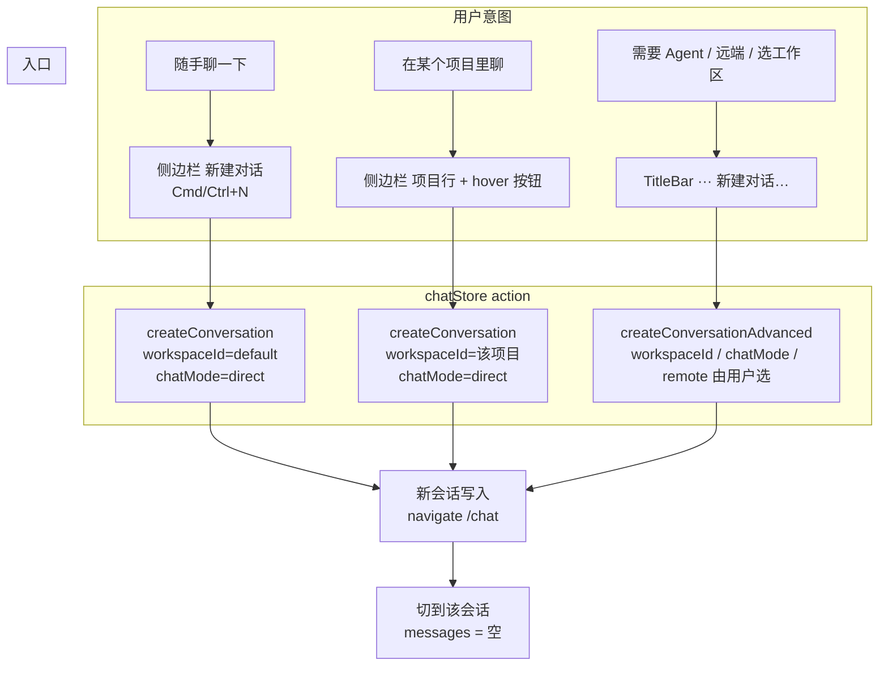
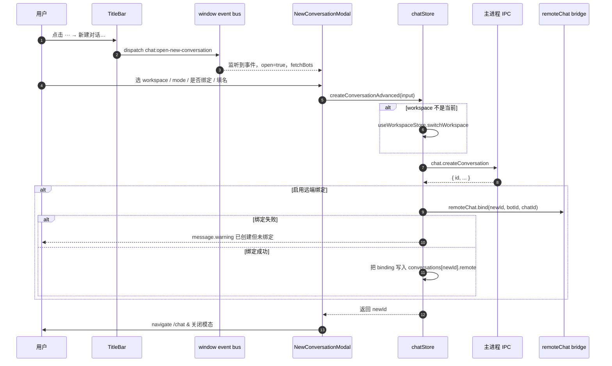
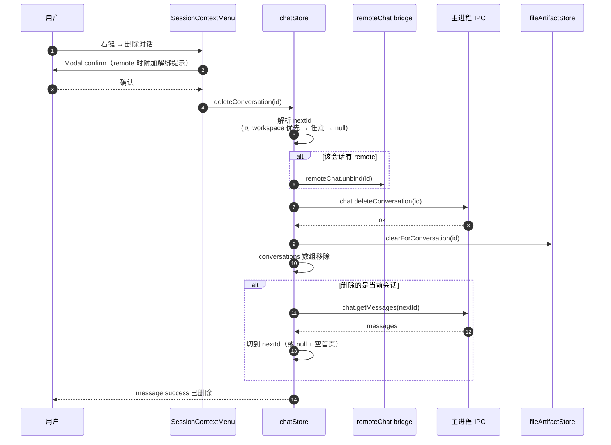
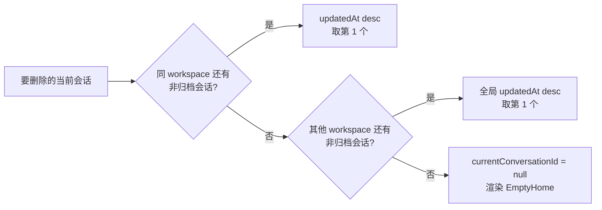
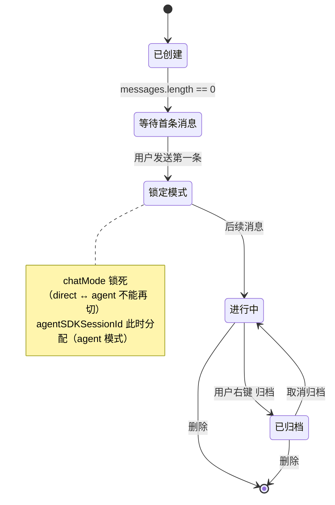

# 会话创建 / 删除流程图（plan §25 落地版）

> 当前重构总入口：[refactor-plan](./refactor-plan.md) ·
> 当前 project/session 主计划：[project-session-redesign-plan](./project-session-redesign-plan.md)
>
> 注意：本文是旧 `workspaceId` 创建 / 删除链路的落地流程图。新 project/session 模型下继续复用入口归一、remote 解绑、next-focus 等规则，但 `workspaceId` 语义需要映射为 `projectId | null`。

本文档配套 `workspace-session-ui-plan.md` §25 使用，把会话生命周期的创建链路和删除链路可视化，避免再出现「同一个意图有 5 个入口」的混乱。所有图都基于已落地的代码（`chatStore` / `AppSidebar` / `ClaudeSidebar` / `TitleBar` / `NewConversationModal` / `SessionContextMenu`）。

---

## 1. 一句话模型

> **一个会话** = `workspaceId` + `chatMode` + 可选 `remote` 绑定。
>
> 三个产品名（普通对话 / 项目对话 / 远端对话）只是这三条轴的不同组合，不是不同的存储实体。

| 产品名 | workspaceId | chatMode | remote |
|---|---|---|---|
| 普通对话 | `default` | `direct` | — |
| 项目对话 | 用户创建的工作区 | `direct` 或 `agent` | — |
| 远端对话 | 任意工作区 | `direct`（强制） | 已绑定 |

---

## 2. 创建入口总图

**核心设计**：意图 → 入口 → action 是 1:1 的，不允许多个入口共用模糊语义。这就是为什么把原来 TitleBar 里的「新建 Agent 对话 / 新建远程对话」合并到一个「新建对话…」模态里——避免 5 个入口、3 种类型的笛卡尔积。

---

## 3. 三条入口的代码定位

| 意图 | 触发位置 | 调用 |
|---|---|---|
| 普通快建 | `AppSidebar.tsx:handleNewTask` / `ClaudeSidebar.tsx:handleNewConversation` | `chatStore.createConversation(undefined, "direct", { workspaceId: defaultId })` |
| 项目内快建 | `AppSidebar.tsx:handleNewTaskInWorkspace`（项目行 hover `+`） | `chatStore.createConversation(undefined, "direct", { workspaceId })` |
| 高级 | `TitleBar.tsx:handleOpenNewConversationModal` → 派发 `chat:open-new-conversation` window event → `NewConversationModal` | `chatStore.createConversationAdvanced({ workspaceId, chatMode, name?, remote? })` |

`Cmd/Ctrl+N` 走的就是普通快建的同一个 handler，未来如要绑定快捷键到高级模态，再单独在 Chat 页面接 `keydown` 即可（参考已有的 `Cmd+M` 模型切换）。

---

## 4. 高级创建模态时序

要点：
- 模态自包含——监听器写在组件内，`MainLayout` 只挂载一次。
- 远端绑定失败不会回滚会话创建（用户不希望已写入的工作丢失）；改为弹 `warning`，让用户事后在 `RemoteBadge` 里手动绑。
- `agent` 模式与 `remote` 互斥，模态里把 mode radio 在 remoteEnabled=true 时禁用。

---

## 5. 删除链路时序

下一焦点解析规则（按优先级）：

---

## 6. 行为矩阵

| 触发 | workspace | mode | remote | 后续 |
|---|---|---|---|---|
| 侧边栏 `新建对话` | `default` | `direct` | — | navigate /chat，切到新会话 |
| 侧边栏 项目行 `+` | 该项目 | `direct` | — | 展开该项目，切到新会话 |
| TitleBar `新建对话…` | 用户选 | 用户选 | 可选 | 视需要切 workspace、bind、navigate |
| `Cmd/Ctrl+N` | `default` | `direct` | — | 同侧边栏新建对话 |
| 右键 → 删除对话 | — | — | 自动解绑 | 解析下一焦点并切换 |
| 右键 → 派生到本地 | 同源 | 同源 | — | 复制消息，写 forkOriginId |
| 右键 → 派生到新工作树 | 同源 | 同源 | — | git worktree add，新会话标记 worktreePath |

---

## 7. 状态机：会话创建到首条消息

> `chatMode` 锁定的实现位于 `useChatPageState` 的发送路径里。模态里允许选 `agent` 模式是「希望首次发送就锁定为 agent」，不会绕过这条规则。

---

## 8. 不应该再做的事（避免回潮）

- ❌ 在侧边栏快捷区放「新建 Agent 对话」按钮——会和「新建对话」语义重叠。Agent 走高级模态。
- ❌ 调 `createConversation` 时不传 `opts.workspaceId`——回到「当前 workspace」语义就是混乱的源头。普通快建一律落 `default`，项目内创建一律传项目 id。
- ❌ 让 `deleteConversation` 之外的代码直接调 `chatHistoryService.deleteConversation`——会绕过远端解绑和 fileArtifact 清理。
- ❌ 删除时先 `set state` 再去算 `nextId`——先解析 nextId，最后一次 set，保证 React 只 re-render 一次且 next focus 不会闪。
- ❌ 在 TitleBar 加更多创建入口——任何新的「特殊会话类型」都应当作为高级模态里的一个选项，而不是新按钮。

---

## 9. 把它当 PR review checklist 用

新功能涉及创建会话时，照这单子过一遍：

- [ ] 你的入口是否落到了第 §3 节的三条之一？没有的话先想清楚为什么，再决定要不要再加。
- [ ] 是否显式传了 `workspaceId`？（普通=`default`，项目=该项目 id，高级=用户选）
- [ ] 是否走 `createConversation` / `createConversationAdvanced`，而不是绕过 store？
- [ ] 创建后是否 `navigate("/chat")` 并自动 focus 到新会话？
- [ ] 如果是远端会话，是否在创建后调用 `remoteChat.bind`，并在失败时给出友好提示而非回滚？

新功能涉及删除时：

- [ ] 是否走 `chatStore.deleteConversation`（而不是直接 IPC）？
- [ ] 是否处理了「删除当前会话」时的 next-focus？
- [ ] 是否在 confirm 弹窗里告知 remote 解绑副作用？
